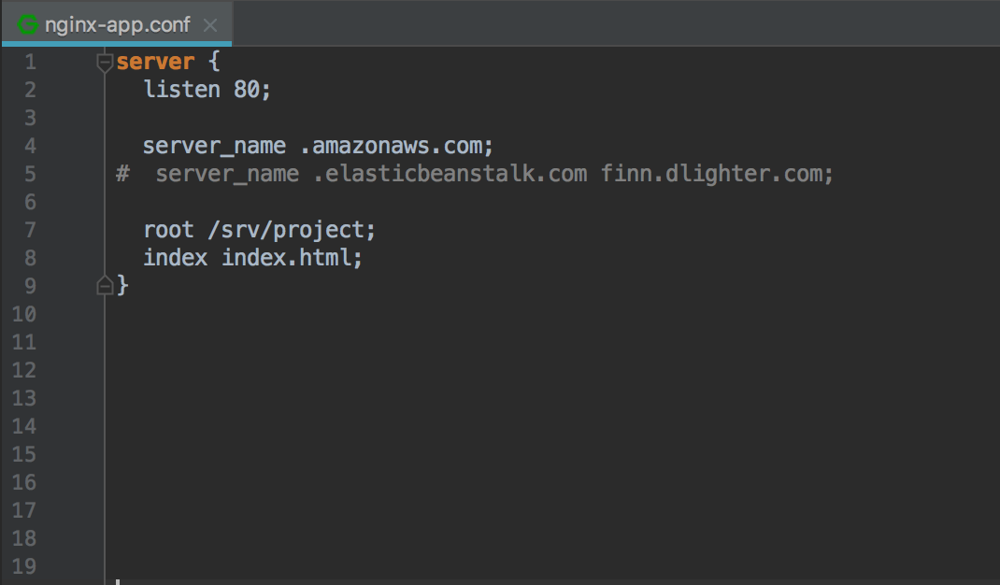
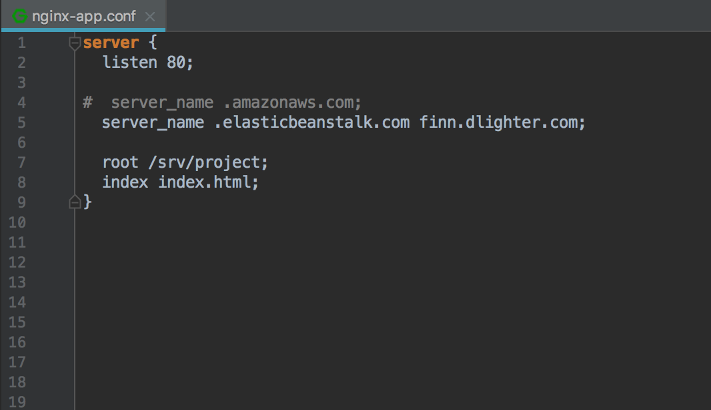

# Finn-Project Airbnb v1.0

기간 - 2018-04-02 ~ 2018-04-27

인원 - 백엔드 2명, 프론트 엔드 3명, IOS 3명 총(8)명

역할 - AWS 배포 및 환경 설정, 유저모델링, 이메일 회원가입, 사용자 GET list/retrieve, 숙소 모델링, 숙소 등록 관련 기능 일체

Airbnb를 copy한 애플리케이션으로 회원가입과 숙소 등록 그리고 숙소 예약 기능이 되는 것을 목표로 하였다.

### 주제 선정 이유

* 에어비앤비는 한 플랫폼 내에 아래와 같은 상품검색, 예약, 메시지전달 등의 다양한 형태의
서비스가 존재하므로, 프로젝트 과정에서 더욱 다양한 경험을 할 수 있겠다 생각함.

* 여행할 지역의 다양한 형태의 숙소 정보를 얻고 예약

* 다양한 체험을 할 수 있는 트립, 레스토랑에 대한 정보와 이용 중개 서비스

* 직접 (ex) 본인의 집) 숙박 서비스를 제공할 수 있는 호스팅 서비스

### MVP 3 (3가지 주요 기능)

1. 회원가입
2. 호스트의 숙소 등록
3. 등록된 숙소를 예약

<br><br><br><br>
## (1) Front-end에서 작업한 결과물을 API server안에서 Serving 하기


<br><br>
### 삽질1 - S3 저장소의 Bucket을 '정적 웹 사이트 호스팅'하기

```
2018.03.27
" Router 53을 쓰게되면 AWS의 서비스 자체에 도메인을 붙일 수 있음.
그래서 어떤 것도 되냐면. 만약에 우리가 정적페이지를 호스팅을 한다.

예를들면 프론트엔드에서 만든 결과물 같은 경우에는 정적인 파일이에요.
그 안에서 동적으로 요청을 하지만 그 프로젝트  자체는 서버의 도움없이
그냥 파일 자체로 존재할 수  있거든요. 그래서 프론트엔드로 만든 결과물은
그냥 S3로 파일을 올린 다음에 그 파일에 도메인을 붙이는 형태로도 호스팅이되요.
그러면 호스팅비용이 진짜 쌉니다... 
"
```


* **문제점**
> 1. 저장소의 권한은 '퍼블릭'하게 설정해야함 (AWS Documentation 참고) -> 모든 사용자에 노출되어 있어 공격에 취약
> 2. https 액세스 지원 x -> 보안에 취약
> 3. 정적파일의 크기가 클 경우 S3에 주기적으로 업로드하는 과정에서 $$$ -> 비용발생


<br><br>
### 삽질2 - ElasticBeanstalk 서비스에서 자동생성한 Amazon Linux AMI 서버에 정적파일을 업로드한 후 EC2의 퍼블릭 DNS(IPv4) 주소로 정적파일(index.html)을 Serving

1. Front-end에서 작업 결과물을 dist 폴더안에 정적파일 형태로 넘겨줌

2. 해당 파일을 ElasticBeanstalk안의 Linux 서버로 전송

    ````
    $ eb ssh ( 또는 ssh -i ~/.ssh/<eb_key_name> ec2-user@52.78.195.234 ) 로 접속

    $ sudo chmod 757 srv

    $ scp -i scp -i ~/.ssh/<eb_key_name> -r ~/projects/finn-front ec2-user@52.78.195.234:/srv

3. nginx 설정 변경
/etc/nginx/sites-available/nginx-app.conf



* **문제점**
> 1. AWS Route53에서 Alias 옵션 설정 불가
> 2. AWS Route53에서 IPv4 address / CNAME (Canonical name) 으로 설정 불가
>    https 액세스 불가


<br><br>
### 삽질3 - ElasticBeanstalk의 finn-eb.ap-northeast-2.elasticbeanstalk.com 로 Serving

1. index.html 파일의 권한(permission) 변경
    $ sudo chmod 757 srv

2. nginx 설정 변경



* **문제점**
> 1. ElasticBeanstalk은 Loadbalancer를 통해 서버의 개수를 늘였다 줄였다 하는
    Auto-scaling을 지원함

    -> 위에서 scp 명령어를 통해 업로드한 파일이 언제든지 삭제될 수 있다는 의미


### 삽질4(금일수업) - "코딩 새로운 시작"


<br><br><br><br>

## (2) APIView에서 Custom Pagination 만들기


<br><br>
* GenericView에서 제공하는 Pagination 사용

```python
class UserListCreateView(generics.ListCreateAPIView):
    pagination_class = DefaultPagination
    [...]
```


```python
class DefaultPagination(pagination.PageNumberPagination):
    page_size = 25
    max_page_size = 50
    page_size_query_param = 'page_size'

```


<br><br>
* APIView에서 손수 정의한 Pagination
```python
class UserListCreateAPIView(APIView):

    [...]

    def get(self, request):

        user_list = User.objects.filter(Q(is_superuser=False), Q(is_staff=False))

        # 1) Pagination 적용 이전
        # return Response(UserSerializer(user_list, many=True).data, status=status.HTTP_200_OK)

        # 2) CustomPagination 사용
        users = UserSerializer(user_list, many=True).data
        pagination = CustomPagination(users, request)

        return Response(pagination.object_list, status=status.HTTP_200_OK)
```


```python
class CustomPagination():
    DEFAULT_PAGE_SIZE = 25
    MAX_PAGE_SIZE = 50

    def __init__(self, users, request):
        self.users = users
        self.page = request.GET.get('page', 1)
        self.page_size = min(int(request.GET.get('page_size', self.DEFAULT_PAGE_SIZE)), self.MAX_PAGE_SIZE)

    @property
    def object_list(self):
        paginator = Paginator(self.users, self.page_size)

        return paginator.get_page(self.page).object_list
```

## * 기존의 GenericView에서 사용하는 Pagination 기능을 수제작
> 1. Querystring으로 전달되는 값을 request.GET 으로 parsing
> 2. python의 min() 함수를 사용해서 page의 최대 개수를 조절
> 3. Paginator 함수를 사용하여 특정 object의 출력 개수를 조정
> 4. 위 과정을 object_list라는 함수에 담고 이 함수를 property 선언하여
    APIView에서 Pythonic하게 활용
> -> GenericView와 동일한 결과값을 출력


<br><br><br><br>

위 4번까지의 과정에서 참고, 사용된 Django 내부 코드들.

<br>
(1) min

```python
def min(*args, key=None): # known special case of min
    """
    min(iterable, *[, default=obj, key=func]) -> value
    min(arg1, arg2, *args, *[, key=func]) -> value

    With a single iterable argument, return its smallest item. The
    default keyword-only argument specifies an object to return if
    the provided iterable is empty.
    With two or more arguments, return the smallest argument.
    """
    pass
```

<br>
(2-1) Paginator.__init__

```python
class Paginator:
    def __init__(self, object_list, per_page, orphans=0,
                 allow_empty_first_page=True):
        self.object_list = object_list
        self._check_object_list_is_ordered()
        self.per_page = int(per_page)
        self.orphans = int(orphans)
        self.allow_empty_first_page = allow_empty_first_page
```

<br>
(2-2) Paginator.get_page

```python
class Paginator:
    def get_page(self, number):
        """
        Return a valid page, even if the page argument isn't a number or isn't
        in range.
        """
        try:
            number = self.validate_number(number)
        except PageNotAnInteger:
            number = 1
        except EmptyPage:
            number = self.num_pages
        return self.page(number)
```


<br>
(3) Page

```python
class Page(collections.Sequence):

    def __init__(self, object_list, number, paginator):
        self.object_list = object_list
        self.number = number
        self.paginator = paginator
```
