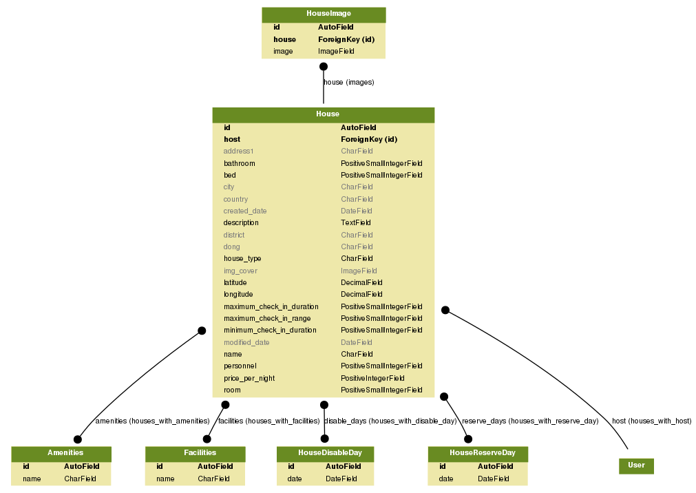
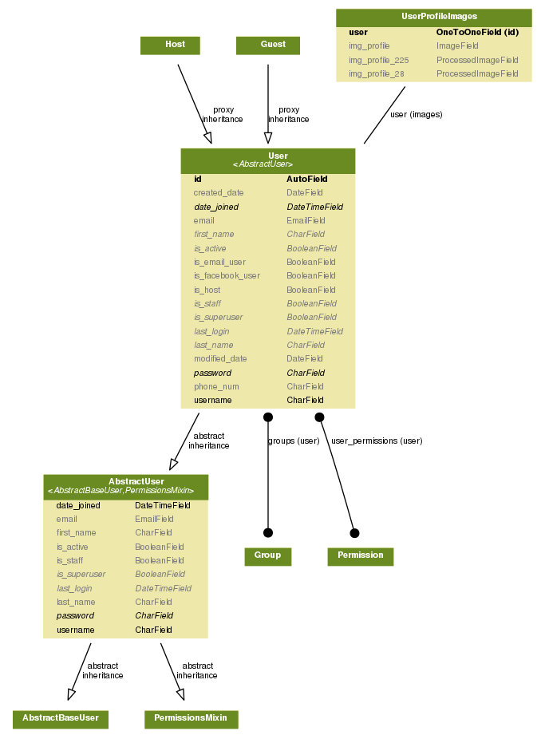
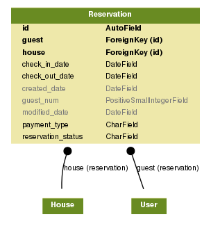
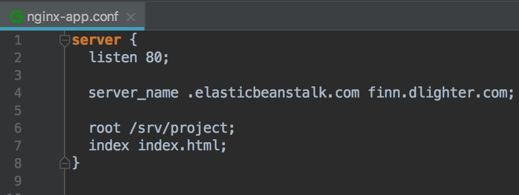

# Finn-Project Airbnb v1.0

기간 - 2018-04-02 ~ 2018-04-27

인원 - 백엔드 2명, 프론트 엔드 3명, IOS 3명 총(8)명

역할 - AWS 배포 및 환경 설정, 유저모델링, 이메일 회원가입, 사용자 GET list/retrieve, 숙소 모델링, 숙소 등록 관련 기능 일체

Airbnb를 copy한 애플리케이션으로 회원가입과 숙소 등록 그리고 숙소 예약 기능이 되는 것을 목표로 하였다.

### 주제 선정 이유

* 에어비앤비는 한 플랫폼 내에 아래와 같은 상품검색, 예약, 메시지전달 등의 다양한 형태의
서비스가 존재하므로, 프로젝트 과정에서 더욱 다양한 경험을 할 수 있겠다 생각함.

* 여행할 지역의 다양한 형태의 숙소 정보를 얻고 예약

* 다양한 체험을 할 수 있는 트립, 레스토랑에 대한 정보와 이용 중개 서비스

* 직접 (ex) 본인의 집) 숙박 서비스를 제공할 수 있는 호스팅 서비스
	
### MVP 3 (3가지 주요 기능)

1. 회원가입 
2. 호스트의 숙소 등록
3. 등록된 숙소를 예약


### 기능 및 특징
* 회원 가입후 숙소를 등록하여 호스트가 되거나 숙소를 예약할 수 있는 시스템
* 숙소 검색의 경우 구글맵의 주소검색을 통해 받아온 구글/애플 맵의 bounding box의 위경도 값(우상단 좌하단)안에 있는 숙소의 리스트를 보여줌
* 숙소와 유저 정보를 가져 올 때 다양한 쿼리 스트링을 통해 필요 한 정보와 순서로 획득 가능
* 숙소의 커버이미지를 등록하면 작은 썸네일 이미지가 자동 생성.
* 여러장의 숙소 이미지 등록 가능.
등등..

# 설치하기
파이썬 패키지 설치와 로컬환경에서의 실행 그리고 도커 빌드에 대해 알아보기

## Requirements

#### 공통사항

* Python (3.6)
* .secrets/의 JSON파일 작성 (아래의 .secrets항목 참조)
* (선택사항) Docker로 실행할 경우, Docker설치 필요

#### AWS 환경

* Python (3.6)
* S3 Bucket, 해당 Bucket을 사용할 수 있는 IAM User의 AWS AccessKey, SecretAccessKey
* RDS Database(보안 그룹 허용 필요), 해당 Database를 사용할 수 있는 RDS의 User, Password

## Installation (Django runserver)

#### 로컬 환경
```
pip install -r .requirements/local.txt
python manage.py runserver
```

#### AWS 환경

```
export DJANGO_SETTINGS_MODULE=config.settings.dev
pip install -r .requirements./dev.txt
python manage.py runserver
```

#### 배포 환경

```
export DJANGO_SETTINGS_MODULE=config.settings.production
pip install -r .requirements./dev.txt
python manage.py runserver
```

## Installation (Docker)

#### 로컬 환경

`localhost:8000` 에서 확인
```
docker build -t airbnb:local -f Dockerfile.local
docker run --rm -it 8000:80 airbnb:local
```

#### AWS 환경 (개발 모드)

```
docker build -t airbnb:dev -f Dockerfile.dev
docker run --rm -it 8000:80 airbnb:dev
```
#### AWS 환경 (배포 모드)

```
docker build -t airbnb:production -f Dockerfile.production
docker run --rm -it 8000:80 airbnb:production
```    

## DockerHub 관련

apt, pip 관련 내용을 미리 빌드해서 DockerHub 저장소에 미리 업로드 하여 사용
```
# DockerFile 위치에 가서
docker build -t airbnb:base -f Dockerfile.base . 
docker tag airbnb:base <자신의 사용자명>/<저장소명>:base
docker push <사용자명>/<저장소명>:base
```
이후 ElasticBeanstalk을 사용한 배포시, 해당 이미지를 사용한다.
```
FROM <사용자명>/<저장소명>:base
...
```

## .secrets

#### .secrets/base.json

```json
{
  "SECRET_KEY": "<Django Secret Key>",
  "RAVEN_CONFIG": {
    "dsn": "<SENTRY_DSN>",
    "release": "raven.fetch_git_sha(os.path.abspath(os.pardir)),"
  },
  "SUPERUSER_USERNAME": "<Default superuser username>",
  "SUPERUSER_PASSWORD": "<Default superuser password>",
  "SUPERUSER_EMAIL": "<Default superuser email>",

  "FACEBOOK_APP_ID" : "<Facebook app id>",
  "FACEBOOK_SECRET_CODE" : "<Facebook secret code>",

  "AWS_ACCESS_KEY_ID": "<AWS access key (Permission: S3)>",
  "AWS_SECRET_ACCESS_KEY": "<AWS secret access key>",
  "AWS_STORAGE_BUCKET_NAME": "<AWS S3 Bucket name>",
 
  "AWS_DEFAULT_ACL": "private",
  "AWS_S3_REGION_NAME": "<AWS Bucket region>",
  "AWS_S3_SIGNATURE_VERSION": "s3v4",
  "AWS_S3_ENDPOINT_URL": "https://s3.ap-northeast-2.amazonaws.com",
```

#### .secrets/dev.json .secrets/production.json

```json
{
  "DATABASES": {
    "default": {
      "ENGINE": "django.db.backends.postgresql",
      "HOST": "<AWS RDS end-point>",
      "NAME": "<DB name>",
      "USER": "<DB username>",
      "PASSWORD": "<DB user password",
      "PORT": 5432
    }
  }
}
```

## 배포

`deploy.sh`파일을 사용
```
./deploy.sh
```

## 테스트 실행하기

```
./manage.py test
```

### End-to-End 테스트

#### members

* `UserSignupTest` - 회원 가입 과 토큰 저장 테스트
* `UserListTest` - 회원 리스트 조회 테스트
* `UserDetailTest` - 회원 개별 조회 테스트
* `UserUpdateTest` - 회원 수정 테스트 
* `UserDeleteTest` - 회원 삭제 테스트
* `UserLoginLogoutTest` - 로그인/로그아웃 테스트

```
./manage.py test members.tests.signup
./manage.py test members.tests.list
./manage.py test members.tests.detail
./manage.py test members.tests.update
./manage.py test members.tests.delete
./manage.py test members.tests.login_logout

# 일괄 테스트
./manage.py test members
```

#### house

* `HouseCreateTest` - 숙소 등록 테스트
* `HouseListTest` - 숙소 리스트 조회 테스트 
* `HouseRetrieveTest` - 숙소 개별 조회 테스트
* `HouseUpdateTest` - 숙소 수정 테스트
* `HousePartialUpdateTest` - 숙소 부분 수정 테스트
* `HouseDeleteTest` - 숙소 삭제 테스트

```
./manage.py test house.tests.create
./manage.py test house.tests.list
./manage.py test house.tests.retrieve
./manage.py test house.tests.update
./manage.py test house.tests.update_partial
./manage.py test house.tests.delete

# 일괄 테스트
./manage.py test house
```

#### reservation


## 사용된 도구 및 기술

* Python 3.6
* Django 2.0
* Facebook
  - Login (web)
  - Login (iOS)
* DRF (Django REST framework)
  - django-filter
  - drf-dynamic-fields
* Git
  - Git Organization
  - Git Fork Repository
* Docker, Dockerhub
* Database 
  - Local(sqlite3)
  - Production&Dev(postgresql)
* AWS
  - Elastic Beanstalk
  - RDS(Relational Database Service)
  - S3
  - Route53
  - ACM (AWS Certificate Manager)

* Sentry

~추가 중~

### App별 Database erd

***숙소***



***유저***



***예약***



## 향후 개선점

* 각 숙소마다 리뷰를 등록할 수 있게 하기.
* 평점 매기기
* 호스트와 게스트간의 다이렉트 메세지 기능 추가
* 카카오톡 로그인 추가
* 숙소 관련 시리얼라이즈를 분리하여 좀 더 확장성 있게 리팩토링 해보기
* 많은 데이터가 있을 경우의 ORM 최적화
* Django Debug tool 사용하여 최적화 해보기
* 결제 모듈
* 위시 리스트
* 추천
* Django Template를 이용하여 사이트 만들어 보기.
* 숙소 썸 네일 이미지 S3 저장 로직 변경
등등..


### 1) Front-end에서 작업한 결과물을 API server안에서 Serving 하기
    


 1. Front-end에서 작업 결과물을 dist 폴더안에 정적파일 형태로 넘겨줌
 2. 해당 파일을 ElasticBeanstalk안의 Linux 서버로 전송
    $ eb ssh ( 또는 ssh -i ~/.ssh/<eb_key_name> ec2-user@52.78.195.234 ) 로 접속
    $ sudo chmod 757 srv
    $ scp -i scp -i ~/.ssh/<eb_key_name> -r ~/projects/finn-front ec2-user@52.78.195.234:/srv

 3. /etc/nginx/sites-available/nginx-app.conf
    


### 2) APIView에서 Custom Pagination 만들기

 1.