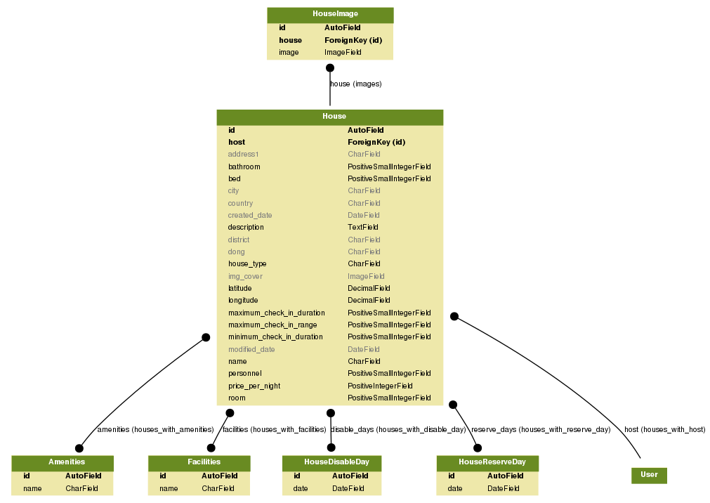
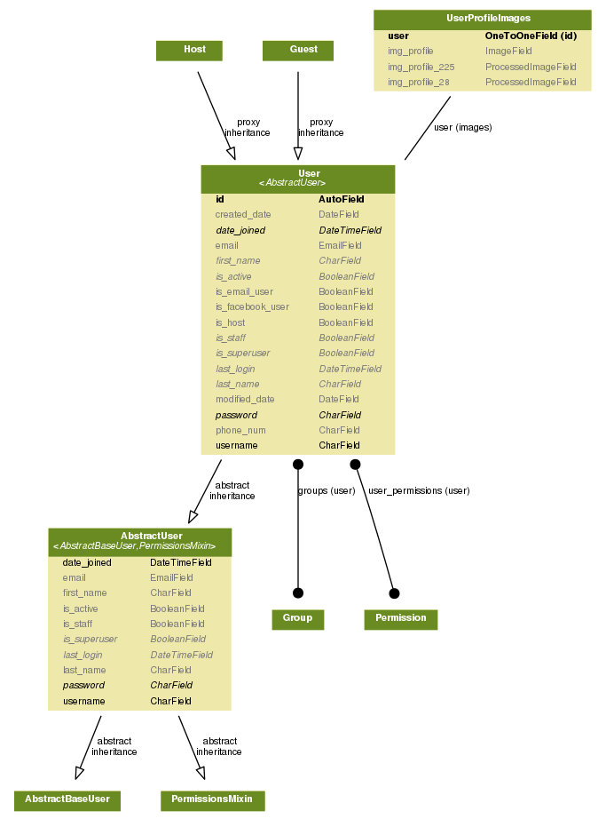
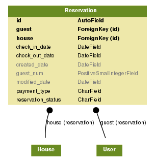
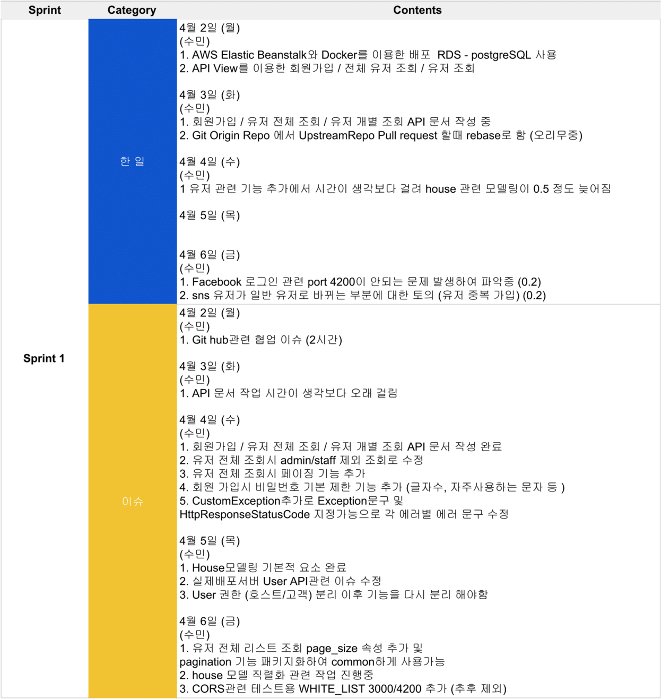
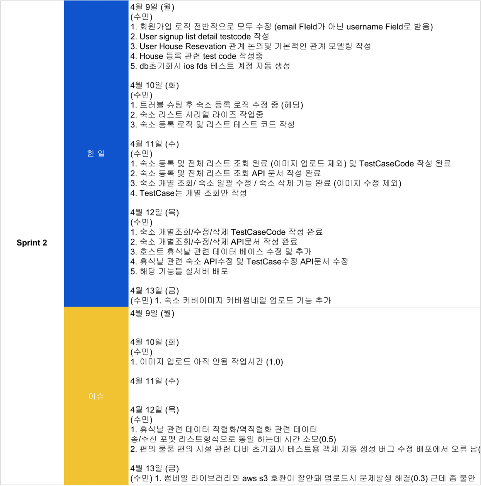
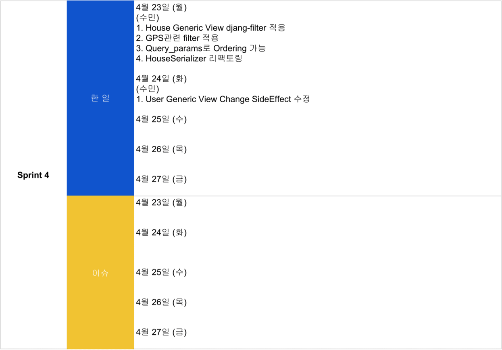
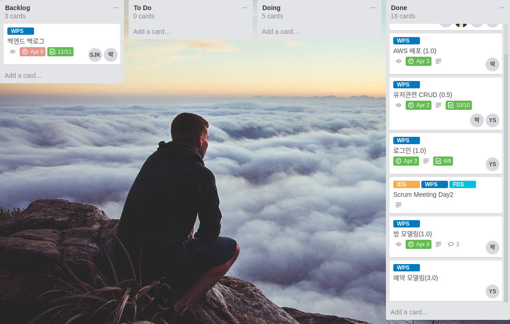
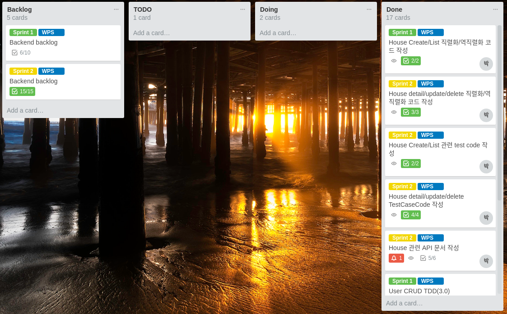
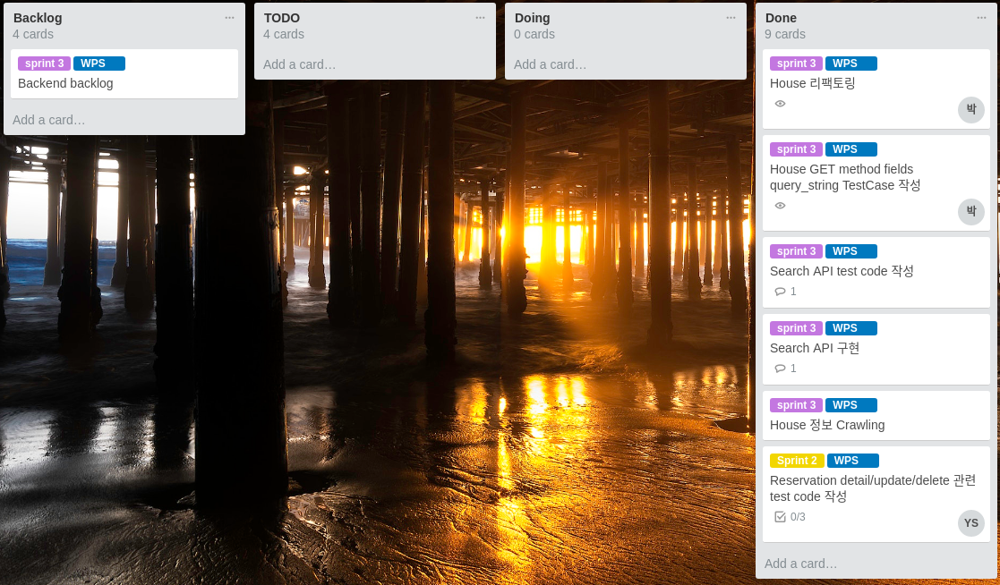
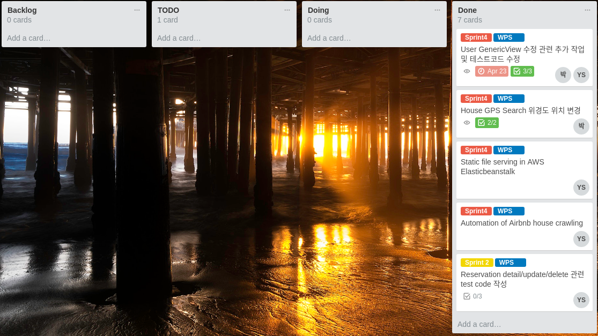

# Finn-Project Airbnb v1.0

기간 - 2018-04-02 ~ 2018-04-27

인원 - 백엔드 2명, 프론트 엔드 3명, IOS 3명 총(8)명

Airbnb를 copy한 애플리케이션으로 회원가입과 숙소 등록 그리고 숙소 예약 기능이 되는 것을 목표로 하였다.

### 주제 선정 이유

* 에어비앤비는 한 플랫폼 내에 아래와 같은 상품검색, 예약, 메시지전달 등의 다양한 형태의
서비스가 존재하므로, 프로젝트 과정에서 더욱 다양한 경험을 할 수 있겠다 생각함.

* 여행할 지역의 다양한 형태의 숙소 정보를 얻고 예약

* 다양한 체험을 할 수 있는 트립, 레스토랑에 대한 정보와 이용 중개 서비스

* 직접 (ex) 본인의 집) 숙박 서비스를 제공할 수 있는 호스팅 서비스
	
### MVP 3 (3가지 주요 기능)

1. 회원가입 
2. 호스트의 숙소 등록
3. 등록된 숙소를 예약


### 기능 및 특징
* 회원 가입후 숙소를 등록하여 호스트가 되거나 숙소를 예약할 수 있는 시스템
* 숙소 검색의 경우 구글맵의 주소검색을 통해 받아온 구글/애플 맵의 bounding box의 위경도 값(우상단 좌하단)안에 있는 숙소의 리스트를 보여줌
* 숙소와 유저 정보를 가져 올 때 다양한 쿼리 스트링을 통해 필요 한 정보와 순서로 획득 가능
* 숙소의 커버이미지를 등록하면 작은 썸네일 이미지가 자동 생성.
* 여러장의 숙소 이미지 등록 가능.
등등..

### 애플리케이션 영상 링크
**IOS**

[](https://youtu.be/DakKUIPhBV8?t=0s)

**WEB**

[](https://youtu.be/z0QJ7pLDDSE?t=0s)

### API 문서 링크
https://legacy.gitbook.com/book/himanmengit/airbnb/details

# 설치하기
파이썬 패키지 설치와 로컬환경에서의 실행 그리고 도커 빌드에 대해 알아보기

## Requirements

#### 공통사항

* Python (3.6)
* .secrets/의 JSON파일 작성 (아래의 .secrets항목 참조)
* (선택사항) Docker로 실행할 경우, Docker설치 필요

#### AWS 환경

* Python (3.6)
* S3 Bucket, 해당 Bucket을 사용할 수 있는 IAM User의 AWS AccessKey, SecretAccessKey
* RDS Database(보안 그룹 허용 필요), 해당 Database를 사용할 수 있는 RDS의 User, Password

## Installation (Django runserver)

#### 로컬 환경
```
pip install -r .requirements/local.txt
python manage.py runserver
```

#### AWS 환경

```
export DJANGO_SETTINGS_MODULE=config.settings.dev
pip install -r .requirements./dev.txt
python manage.py runserver
```

#### 배포 환경

```
export DJANGO_SETTINGS_MODULE=config.settings.production
pip install -r .requirements./dev.txt
python manage.py runserver
```

## Installation (Docker)

#### 로컬 환경

`localhost:8000` 에서 확인
```
docker build -t airbnb:local -f Dockerfile.local
docker run --rm -it 8000:80 airbnb:local
```

#### AWS 환경 (개발 모드)

```
docker build -t airbnb:dev -f Dockerfile.dev
docker run --rm -it 8000:80 airbnb:dev
```
#### AWS 환경 (배포 모드)

```
docker build -t airbnb:production -f Dockerfile.production
docker run --rm -it 8000:80 airbnb:production
```    

## DockerHub 관련

apt, pip 관련 내용을 미리 빌드해서 DockerHub 저장소에 미리 업로드 하여 사용
```
# DockerFile 위치에 가서
docker build -t airbnb:base -f Dockerfile.base . 
docker tag airbnb:base <자신의 사용자명>/<저장소명>:base
docker push <사용자명>/<저장소명>:base
```
이후 ElasticBeanstalk을 사용한 배포시, 해당 이미지를 사용한다.
```
FROM <사용자명>/<저장소명>:base
...
```

## .secrets

#### .secrets/base.json

```json
{
  "SECRET_KEY": "<Django Secret Key>",
  "RAVEN_CONFIG": {
    "dsn": "<SENTRY_DSN>",
    "release": "raven.fetch_git_sha(os.path.abspath(os.pardir)),"
  },
  "SUPERUSER_USERNAME": "<Default superuser username>",
  "SUPERUSER_PASSWORD": "<Default superuser password>",
  "SUPERUSER_EMAIL": "<Default superuser email>",

  "FACEBOOK_APP_ID" : "<Facebook app id>",
  "FACEBOOK_SECRET_CODE" : "<Facebook secret code>",

  "AWS_ACCESS_KEY_ID": "<AWS access key (Permission: S3)>",
  "AWS_SECRET_ACCESS_KEY": "<AWS secret access key>",
  "AWS_STORAGE_BUCKET_NAME": "<AWS S3 Bucket name>",
 
  "AWS_DEFAULT_ACL": "private",
  "AWS_S3_REGION_NAME": "<AWS Bucket region>",
  "AWS_S3_SIGNATURE_VERSION": "s3v4",
  "AWS_S3_ENDPOINT_URL": "https://s3.ap-northeast-2.amazonaws.com",
```

#### .secrets/dev.json .secrets/production.json

```json
{
  "DATABASES": {
    "default": {
      "ENGINE": "django.db.backends.postgresql",
      "HOST": "<AWS RDS end-point>",
      "NAME": "<DB name>",
      "USER": "<DB username>",
      "PASSWORD": "<DB user password",
      "PORT": 5432
    }
  }
}
```

## 배포

`deploy.sh`파일을 사용
```
./deploy.sh
```

## 테스트 실행하기

```
./manage.py test
```

### End-to-End 테스트

#### members

* `UserSignupTest` - 회원 가입 과 토큰 저장 테스트
* `UserListTest` - 회원 리스트 조회 테스트
* `UserDetailTest` - 회원 개별 조회 테스트
* `UserUpdateTest` - 회원 수정 테스트 
* `UserDeleteTest` - 회원 삭제 테스트
* `UserLoginLogoutTest` - 로그인/로그아웃 테스트

```
./manage.py test members.tests.signup
./manage.py test members.tests.list
./manage.py test members.tests.detail
./manage.py test members.tests.update
./manage.py test members.tests.delete
./manage.py test members.tests.login_logout

# 일괄 테스트
./manage.py test members
```

#### house

* `HouseCreateTest` - 숙소 등록 테스트
* `HouseListTest` - 숙소 리스트 조회 테스트 
* `HouseRetrieveTest` - 숙소 개별 조회 테스트
* `HouseUpdateTest` - 숙소 수정 테스트
* `HousePartialUpdateTest` - 숙소 부분 수정 테스트
* `HouseDeleteTest` - 숙소 삭제 테스트

```
./manage.py test house.tests.create
./manage.py test house.tests.list
./manage.py test house.tests.retrieve
./manage.py test house.tests.update
./manage.py test house.tests.update_partial
./manage.py test house.tests.delete

# 일괄 테스트
./manage.py test house
```

#### reservation


## 사용된 도구 및 기술

* Python 3.6
* Django 2.0
* Facebook
* AWS 
* Elastic Beanstalk
* Rds
* S3
* Route53
* Docker, DockerHub
* Database 
    * Local(sqlite3)
    * Production&Dev(postgresql)
* Git
* Sentry
* django-filter
* django-imagekit
* django-restframework
* drf-dynamic-fields
* selenium (for crawling)

<추가 내용>

등등

### App별 Database erd

***숙소***



***유저***



***예약***



## Code Review(박수민, 송영기)
 
### by 박수민
#### members (signup, list, retrieve)

처음 유저 뷰를 만들때 `GenericView`를 쓰지 않고 `APIView`를 사용 하여 작업. 
이유는 `APIView`와 `serializer`의 동작을 더 정확하게 이해하고 넘어 가기 위해서 사용함.
유저를 만드는 `UserCreateSerializer`와 유저데이터를 직렬화를 해주는 `UserSerializer`를 분리 하여 사용

이후 유저 관련 모든 기능은 다시 `GerericView`로 수정

[소스코드](./app/members/apis/user_api.py)

```python 
class UserListCreateAPIView(APIView):
    def post(self, request):
        serializer = UserCreateSerializer(data=request.data)
        ....
        return Response(data, status=status.HTTP_201_CREATED)
        

    def get(self, request):
        user_list = User.objects.filter(Q(is_superuser=False), Q(is_staff=False))
        users = UserSerializer(user_list, many=True).data
        pagination = CustomPagination(users, request)
        return Response(pagination.object_list, status=status.HTTP_200_OK)


class UserRetrieveUpdateDestroyAPIView(APIView):
    def get(self, request, pk):
        data = {
            'user': UserSerializer(get_object_or_404(User, pk=pk)).data
        }
        return Response(data, status=status.HTTP_200_OK)        
    ....
```

유저를 만들때는 `User`모델에 `UserManager`를 새로 만들어 `create_django_user`로 유저 생성.
이유는 유저 생성과 `UserCreateSeializer`의 약한 결합을 위한 분리.

[소스코드](./app/members/models.py)

```python
class UserManager(DjangoUserManager):
    def create_django_user(self, *args, **kwargs):
        ....
        return user
``` 

`APIView`로 만들고 보니 `Pagination` 기능이 없어 직접 만들어 사용.

[소스코드](./app/utils/pagination/custom_pagination.py)

```python
class CustomPagination():
    DEFAULT_PAGE_SIZE = 25
    MAX_PAGE_SIZE = 50

    def __init__(self, users, request):
        self.users = users
        self.page = request.GET.get('page', 1)
        self.page_size = min(int(request.GET.get('page_size', self.DEFAULT_PAGE_SIZE)), self.MAX_PAGE_SIZE)

    @property
    def object_list(self):
        paginator = Paginator(self.users, self.page_size)

        return paginator.get_page(self.page).object_list
```

게스트와 호스트의 기능 분리를 위해 `proxyModel`을 이용.
그리고 분리된 유저 속성을 따로 가져오기 위해 매니저를 재정의 후 `get_queryset`을 오버라이딩 함.

[소스코드](./app/members/models.py)

```python
class HostManager(Manager):
    def get_queryset(self):
        return super().get_queryset().filter(is_host=True)


class Host(User):
    objects = HostManager()

    class Meta:
        proxy = True

# 게스트도 동일 함.
```

유저 관련 생성 관련 하여 `username`과 `password`의 `validate`를 따로 작업 후 `CustomException`을 만들어 발생 시킴

[소스코드](./app/utils/exception/custom_exception.py)

```python
class CustomException(APIException):
    detail = 'Invalid'
    status_code = status.HTTP_400_BAD_REQUEST

    def __init__(self, detail=None, status_code=None):
      
        if isinstance(detail, list):
            detail = [detail]

        CustomException.status_code = status_code
        CustomException.detail = detail
```

[소스코드](./app/members/serializers/user_create.py)

```python
def validate_username(self, username):
    if User.objects.filter(Q(username=username) | Q(email=username)).exists():
        raise CustomException(detail='이미 존재하는 메일주소 입니다.', status_code=status.HTTP_409_CONFLICT)
    return username
```

#### house
숙소 모델은 기본 `airbnb`의 모델보다 많이 축약시킨 모델링.
숙소의 기본정보와 호스트 이미지 등이 포함.

썸네일 이미지는 `django-imagekit` 패키지를 이용하여 리사이징된 썸네일 이미지를 자동 생성되게 함.
`S3`에 리사이징된 썸네일 이미지가 삭제 되지 않는 문제 발생.
`image-kit`으로 `aws s3`에 이미지 업로드시 알수 없는 `I/O`에러 발생 
해당 패키지의 GitHub 이슈 페이지에서 해결 방법을 찾음.

[소스코드](./app/house/models/house.py)

```python
img_cover = models.ImageField(upload_to=dynamic_img_cover_path, blank=True, default='')

img_cover_thumbnail = ImageSpecField(
    source='img_cover',
    ....
    )
```

그리고 숙소와 관련된 이미지들의 경로는 숙소의 `pk`를 사용하기 때문에 숙소를 만들고 난후 이미지들을 생성함.

[소스코드](./app/house/serializers/house.py)

```python
    def create(self, validated_data):
        validated_data.pop('img_cover', None)

        request = self.context.get('request')

        validated_data['host'] = request.user
        house = super().create(validated_data)

        for date in request.data.getlist('disable_days'):
            date_instance, created = HouseDisableDay.objects.get_or_create(date=date)
            house.disable_days.add(date_instance)

        if request.FILES:
            for img_cover in request.data.getlist('img_cover'):
                house.img_cover.save(img_cover.name, img_cover)

            for room_image in request.data.getlist('house_images'):
                house.images.create_image(image=room_image)

        request.user.is_host = True
        request.user.save()

        return house
```
또한 커버이미지는 `DRF serializer`의 `ImageField`를 사용하여 자동 `validation`을 하게 하였고
 `foreignkey` 로 연결된 내부 이미지는 매니저를 재정의 하여 `validation`을 함
`disable_days`필드도 마찬가지로 매니저를 재정의 하여 `validation`함.

[소스코드](./app/house/models/managers.py)

```python
class HouseDisableDayManager(models.Manager):
    def get_or_create(self, date):
        try:
            datetime.datetime.strptime(date, '%Y-%m-%d')
        except ValueError:
            raise CustomException(f'올바른 날짜 형식이 아닙니다 ({date})', status_code=status.HTTP_400_BAD_REQUEST)

        return super().get_or_create(date=date)


class HouseImageManager(models.Manager):
    def create_image(self, image):
        try:
            Image.open(image).verify()
        except OSError:
            raise CustomException(f'올바른 이미지 파일 형식이 아닙니다. ({image.name})', status_code=status.HTTP_400_BAD_REQUEST)

        return self.create(image=image)
``` 

그리고 숙소 리스트 조회시 필요한 `field`들만 가져오고 싶어서 `drf-dynamic-fields` 패키지를 사용함.
`Serializer`에 `DynamicFieldsMixin`을 `Mixin`을 사용함.
사용방법은 `GET /house/?fields=pk,username`의 형식으로 사용 가능

[소스코드](./app/house/serializers/house.py)

```
class HouseSerializer(DynamicFieldsMixin, serializers.ModelSerializer):
    ....
```

또한 리스트 조회시 프론트/IOS 에서 보내주는 우상/좌하 단의 gps(위경도)를 받아 해당 위경도 안의 숙소 리스트를 반환.
`django-filter` 패키지를 사용함.
`ordering`기능도 같이 추가 함.

사용방법은 `GET /house/?ordering=-pk&ne_lat=12.123123&ne_lng=123.1231231&sw_lat=12.123123&sw_lng=123.123123`의 형식으로 사용 가능

[소스코드](./app/house/apis/house.py)

```python
class GpsFilter(filters.FilterSet):
    ne_lat = filters.NumberFilter(name='latitude', lookup_expr='lte')
    ne_lng = filters.NumberFilter(name='longitude', lookup_expr='lte')
    sw_lat = filters.NumberFilter(name='latitude', lookup_expr='gte')
    sw_lng = filters.NumberFilter(name='longitude', lookup_expr='gte')

    class Meta:
        model = House
        fields = (
            'ne_lat',
            'ne_lng',
            'sw_lat',
            'sw_lng',
        )


class HouseListCreateAPIView(generics.ListCreateAPIView):
    queryset = House.objects.all()
    serializer_class = HouseSerializer
    pagination_class = DefaultPagination

    filter_class = GpsFilter

    filter_backends = (filters.DjangoFilterBackend, OrderingFilter)
    ordering_fields = ('pk', 'name',)
    ordering = ('created_date',)

    ...
```

받는 형식과 보내주는 형식을 최대한 마추기위해 다양한 필드를 사용
`SlugRelatedField`를 사용하여 `disable_days`의 `date`필드만 리스트에 넣어서 보내줌.
`HouseImageField`를 `serializers.RelatedField`를 상속 받아 만들어 `response` 할때 
해당 이미지의 `url`만을 뽑아 리스트에 넣어 보내줌.

[소스코드](./app/house/serializers/house.py)

```python
class HouseImageField(serializers.RelatedField):
    def to_representation(self, value):
        if hasattr(value, 'image'):
            if self.context.get('request'):
                return self.context.get('request').build_absolute_uri(value.image.url)
            else:
                return value.image.url
                
class HouseSerializer(DynamicFieldsMixin, serializers.ModelSerializer):
    host = UserSerializer(read_only=True)
    disable_days = serializers.SlugRelatedField(many=True, read_only=True, slug_field='date')
    reserve_days = serializers.SlugRelatedField(many=True, read_only=True, slug_field='date')
    img_cover = serializers.ImageField(required=False)
    img_cover_thumbnail = serializers.ImageField(read_only=True)
    house_images = HouseImageField(many=True, read_only=True, source='images')
    
    ...
```

#### 배포
`ebextensions`의 `files`를 사용하여 배포후 자동으로 해야할 작업들을 정의함.
```yaml
files:
  "/opt/elasticbeanstalk/hooks/appdeploy/post/01_migrate.sh":
    mode: "000755"
    owner: root
    group: root
    content: |
      #!/usr/bin/env bash
      if [ -f /tmp/migrate ]
      then
        rm /tmp/migrate
        sudo docker exec `sudo docker ps -q` /srv/project/app/manage.py migrate --noinput
      fi

  "/opt/elasticbeanstalk/hooks/appdeploy/post/02_collectstatic.sh":
    ...

  "/opt/elasticbeanstalk/hooks/appdeploy/post/03_createsu.sh":
    ...

  "/opt/elasticbeanstalk/hooks/appdeploy/post/04_createservice.sh":
    ...
```

그리고 `container_commands`를 이용하여 해당 커맨드들을 실행 시킴.<br>
S3를 사용하지 않도록 설정하였으므로 모든 EC2에 정적파일이 존재할 수 있도록 leader_only 옵션 해제.

```yaml
container_commands:
  01_migrate:
    command:  "touch /tmp/migrate"
    leader_only: true
  02_collectstatic:
    command:  "touch /tmp/collectstatic"
  03_createsu:
    command:  "touch /tmp/createsu"
    leader_only: true
  04_createservice:
    command:  "touch /tmp/createservice"
    leader_only: true
``` 

`deploy`시 `.secrets`폴더를 `git`의 `stage`영역에 추가 한 후 작업 완료 후 다시 삭제

```yaml
git add -f .secrets && eb deploy --staged --profile=airbnb; git reset HEAD .secrets
```

## 향후 개선점

* 각 숙소마다 리뷰를 등록할 수 있게 하기.
* 평점 매기기
* 호스트와 게스트간의 다이렉트 메세지 기능 추가
* 카카오톡 로그인 추가
* 숙소 관련 시리얼라이즈를 분리하여 좀 더 확장성 있게 리팩토링 해보기
* 많은 데이터가 있을 경우의 ORM 최적화
* Django Debug tool 사용하여 최적화 해보기
* 결제 모듈
* 위시 리스트
* 추천
* Django Template를 이용하여 사이트 만들어 보기.
* 숙소 썸 네일 이미지 S3 저장 로직 변경
등등..

## 스크럼 보드 

***박수민***

#### Sprint1



#### Sprint2



#### Sprint3


#### Sprint4



***송영기***


## 트렐로

#### Sprint1


#### Sprint2


#### Sprint3


#### Sprint4

