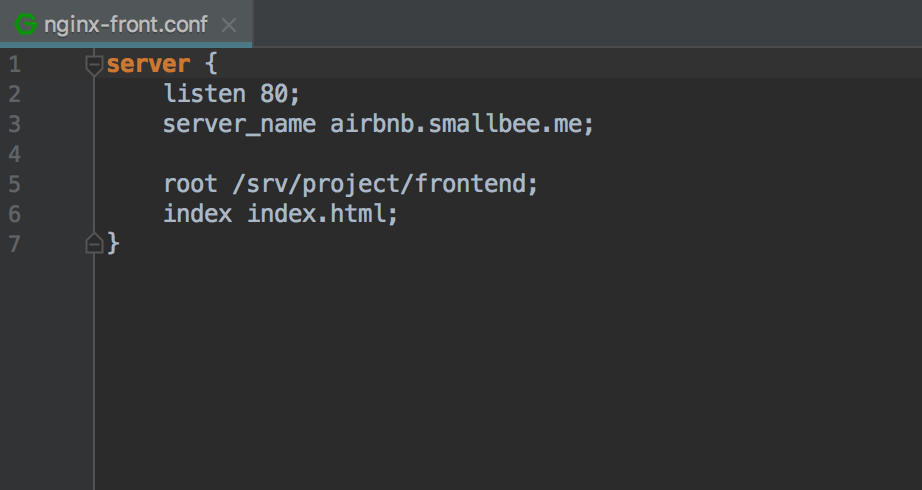
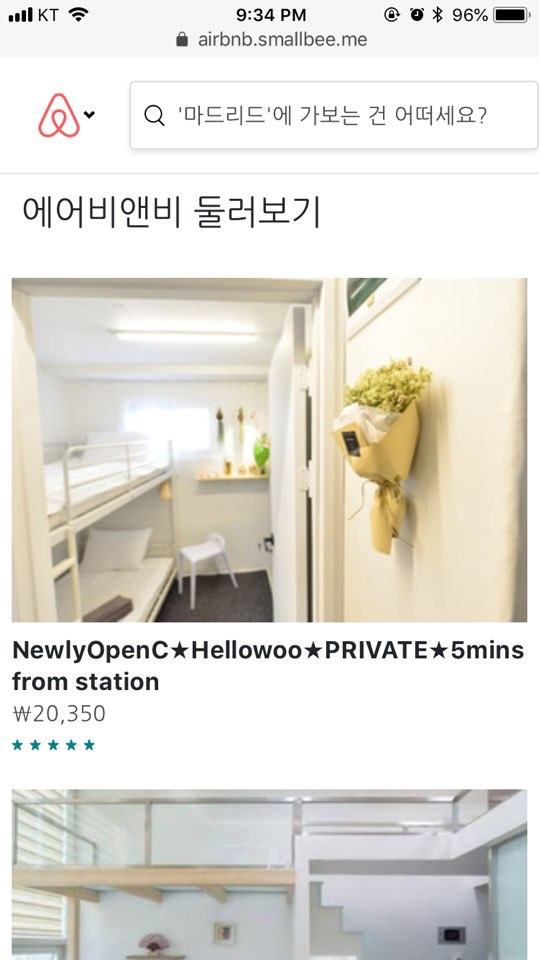
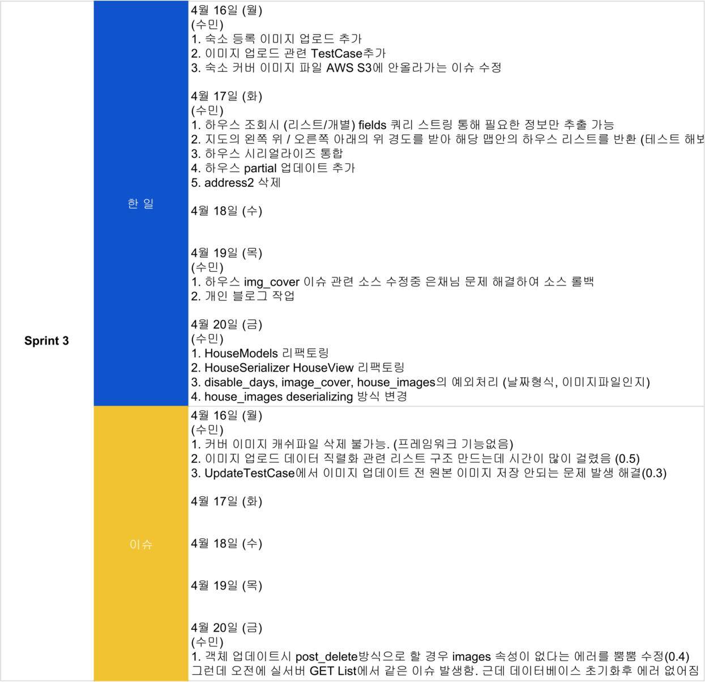
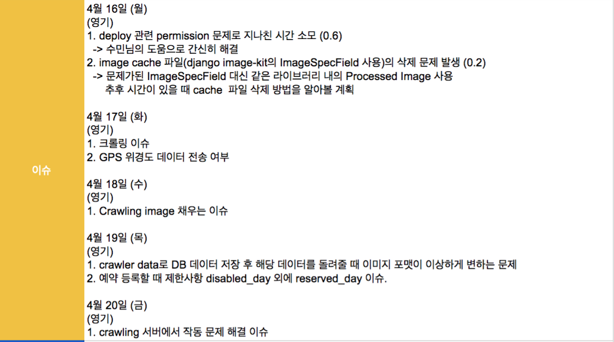

# Finn-Project Airbnb v1.0


웹 서비스 주소 : https://airbnb.smallbee.me

<br>

#### 기간 - 2018-04-02 ~ 2018-04-27
#### 인원 - 백엔드 2명, 프론트 엔드 3명, IOS 3명 총(8)명
#### 목표 - Airbnb를 copy한 애플리케이션으로 회원가입과 숙소 등록 그리고 숙소 예약 기능이 되는 것을 목표로 하였다.

<br>

## 주제 선정 이유
* 에어비앤비는 한 플랫폼 내에 아래와 같은 상품검색, 예약, 메시지전달 등의 다양한 형태의
서비스가 존재하므로, 프로젝트 과정에서 더욱 다양한 경험을 할 수 있겠다 생각함.
* 여행할 지역의 다양한 형태의 숙소 정보를 얻고 예약
* 다양한 체험을 할 수 있는 트립, 레스토랑에 대한 정보와 이용 중개 서비스
* 직접 (ex) 본인의 집) 숙박 서비스를 제공할 수 있는 호스팅 서비스

## MVP 3 (3가지 주요 기능)
1. 회원가입
2. 호스트의 숙소 등록
3. 등록된 숙소를 예약


## 기능 및 특징
* 회원 가입후 숙소를 등록하여 호스트가 되거나 숙소를 예약할 수 있는 시스템
* 숙소 검색의 경우 구글맵의 주소검색을 통해 받아온 구글/애플 맵의 bounding box의 위경도 값(우상단 좌하단)안에 있는 숙소의 리스트를 보여줌
* 숙소와 유저 정보를 가져 올 때 다양한 쿼리 스트링을 통해 필요 한 정보와 순서로 획득 가능
* 숙소의 커버이미지를 등록하면 작은 썸네일 이미지가 자동 생성.
* 여러장의 숙소 이미지 등록 가능.
등등..


## 애플리케이션 영상 링크

**IOS**

[](https://youtu.be/DakKUIPhBV8?t=0s)


**WEB**

[](https://youtu.be/z0QJ7pLDDSE?t=0s)

<br>


## API 문서 링크
https://legacy.gitbook.com/book/smallbee3/airbnb/details (우측의 Read 클릭)

<br>

---

## 목차
[1. 사용된 도구 및 기술](https://github.com/smallbee3/Finn-project/tree/dev#1-%EC%82%AC%EC%9A%A9%EB%90%9C-%EB%8F%84%EA%B5%AC-%EB%B0%8F-%EA%B8%B0%EC%88%A0) \
[2. 설치하기](https://github.com/smallbee3/Finn-project/tree/dev#2-%EC%84%A4%EC%B9%98%ED%95%98%EA%B8%B0) \
[3. Secrets 키 관리하기](https://github.com/smallbee3/Finn-project/tree/dev#3-secrets-%ED%82%A4-%EA%B4%80%EB%A6%AC) \
[4. Deploy 하기](https://github.com/smallbee3/Finn-project/tree/dev#4-deploy-%ED%95%98%EA%B8%B0) \
[5. Test 실행하기](https://github.com/smallbee3/Finn-project/tree/dev#5-test-%EC%8B%A4%ED%96%89%ED%95%98%EA%B8%B0) \
[6. 모델링하기 (erd)](https://github.com/smallbee3/Finn-project/tree/dev#6-%EB%AA%A8%EB%8D%B8%EB%A7%81%ED%95%98%EA%B8%B0-erd) \
[7. Reviews](https://github.com/smallbee3/Finn-project/tree/dev#code-review%EB%B0%95%EC%88%98%EB%AF%BC-%EC%86%A1%EC%98%81%EA%B8%B0) \
        - [by 박수민](https://github.com/smallbee3/Finn-project/tree/dev#by-%EB%B0%95%EC%88%98%EB%AF%BC) \
        - [by 송영기](https://github.com/smallbee3/Finn-project/tree/dev#by-%EC%86%A1%EC%98%81%EA%B8%B0) \
[8. 스크럼 보드](https://github.com/smallbee3/Finn-project/tree/dev#8-%EC%8A%A4%ED%81%AC%EB%9F%BC-%EB%B3%B4%EB%93%9C) \
[9. 트렐로 보드](https://github.com/smallbee3/Finn-project/tree/dev#9-%ED%8A%B8%EB%A0%90%EB%A1%9C)


<br>
<br><br>


## 1. 사용된 도구 및 기술

* Python 3.6.4
* Django 2.0.3
  - django-imagekit 4.0.2
* Django REST framework 3.7.7
  - django-filter 1.1.0
  - Dynamic Fields Mixin 0.3.0
* AWS
  - Elastic Beanstalk
  - RDS(Relational Database Service)
  - S3
  - Route53
  - ACM (AWS Certificate Manager)
* Docker, Dockerhub
* CI
  - Travis
* OAuth (Web, iOS)
  - Facebook Login
* Database
  - Local(sqlite3)
  - Production & Dev(postgresql)
* Server
  - Nginx
* Crawling
  - Selenium 3.11.0
  - Beautifulsoup4 4.6.0
  - lxml 4.2.1
* Git
  - Git Organization
  - Git Fork Repository
* etc
  - Sentry


<br><br>


## 2. 설치하기
파이썬 패키지 설치와 로컬환경에서의 실행 그리고 도커 빌드에 대해 알아보기

## Requirements

#### 공통사항

* Python (3.6)
* .secrets/의 JSON파일 작성 (아래의 .secrets항목 참조)
* (선택사항) Docker로 실행할 경우, Docker설치 필요

#### AWS 환경

* Python (3.6)
* S3 Bucket, 해당 Bucket을 사용할 수 있는 IAM User의 AWS AccessKey, SecretAccessKey
* RDS Database(보안 그룹 허용 필요), 해당 Database를 사용할 수 있는 RDS의 User, Password


<br>

## Installation (Django runserver)

#### 로컬 환경
```
pip install -r .requirements/local.txt
python manage.py runserver
```

#### AWS 환경

```
export DJANGO_SETTINGS_MODULE=config.settings.dev
pip install -r .requirements./dev.txt
python manage.py runserver
```

#### 배포 환경

```
export DJANGO_SETTINGS_MODULE=config.settings.production
pip install -r .requirements./dev.txt
python manage.py runserver
```

<br>

## Installation (Docker)

#### 로컬 환경

`localhost:8000` 에서 확인
```
docker build -t airbnb:local -f Dockerfile.local
docker run --rm -it 8000:80 airbnb:local
```

#### AWS 환경 (개발 모드)

```
docker build -t airbnb:dev -f Dockerfile.dev
docker run --rm -it 8000:80 airbnb:dev
```
#### AWS 환경 (배포 모드)

```
docker build -t airbnb:production -f Dockerfile.production
docker run --rm -it 8000:80 airbnb:production
```

<br>

## DockerHub 관련

apt, pip 관련 내용을 미리 빌드해서 DockerHub 저장소에 미리 업로드 하여 사용
```
# DockerFile 위치에 가서
docker build -t airbnb:base -f Dockerfile.base .
docker tag airbnb:base <자신의 사용자명>/<저장소명>:base
docker push <사용자명>/<저장소명>:base
```
이후 ElasticBeanstalk을 사용한 배포시, 해당 이미지를 사용한다.
```
FROM <사용자명>/<저장소명>:base
...
```

<br><br>


## 3. secrets 키 관리

django app이 위치한 ROOT Directory에 .secrets라는 폴더를 만들고 아래 json 데이터들을 넣는다.

project/app \
project/.secrets/base.json \
project/.secrets/producton.json


#### .secrets/base.json

```json
{
  "SECRET_KEY": "<Django Secret Key>",
  "RAVEN_CONFIG": {
    "dsn": "<SENTRY_DSN>",
    "release": "raven.fetch_git_sha(os.path.abspath(os.pardir)),"
  },
  "SUPERUSER_USERNAME": "<Default superuser username>",
  "SUPERUSER_PASSWORD": "<Default superuser password>",
  "SUPERUSER_EMAIL": "<Default superuser email>",

  "FACEBOOK_APP_ID" : "<Facebook app id>",
  "FACEBOOK_SECRET_CODE" : "<Facebook secret code>",

  "AWS_ACCESS_KEY_ID": "<AWS access key (Permission: S3)>",
  "AWS_SECRET_ACCESS_KEY": "<AWS secret access key>",
  "AWS_STORAGE_BUCKET_NAME": "<AWS S3 Bucket name>",

  "AWS_DEFAULT_ACL": "private",
  "AWS_S3_REGION_NAME": "<AWS Bucket region>",
  "AWS_S3_SIGNATURE_VERSION": "s3v4",
  "AWS_S3_ENDPOINT_URL": "https://s3.ap-northeast-2.amazonaws.com"
}
```

#### .secrets/dev.json .secrets/production.json

```json
{
  "DATABASES": {
    "default": {
      "ENGINE": "django.db.backends.postgresql",
      "HOST": "<AWS RDS end-point>",
      "NAME": "<DB name>",
      "USER": "<DB username>",
      "PASSWORD": "<DB user password",
      "PORT": 5432
    }
  }
}
```

위의 json 형식의 파일을 읽는 코드는 다음과 같다.


```python

# BASE_DIR = os.path.dirname(os.path.dirname(os.path.abspath(__file__)))

# Changed default 'BASE_DIR' as below
# This is because settings is refactored as package. so the depth of current module(base.py) become one depth deeper.
BASE_DIR = os.path.dirname(os.path.dirname(os.path.dirname(os.path.abspath(__file__))))
ROOT_DIR = os.path.dirname(BASE_DIR)

SECRETS_DIR = os.path.join(ROOT_DIR, '.secrets')
SECRETS_BASE = os.path.join(SECRETS_DIR, 'base.json')
SECRETS_PRODUCTION = os.path.join(SECRETS_DIR, 'production.json')

secrets_base_dict = json.loads(open(SECRETS_BASE, 'rt').read())

SECRET_KEY = secrets_base_dict['SECRET_KEY']
SUPERUSER_USERNAME = secrets_base_dict['SUPERUSER_USERNAME']
SUPERUSER_PASSWORD = secrets_base_dict['SUPERUSER_PASSWORD']
SUPERUSER_EMAIL = secrets_base_dict['SUPERUSER_EMAIL']
FACEBOOK_APP_ID = secrets_base_dict['FACEBOOK_APP_ID']
FACEBOOK_SECRET_CODE = secrets_base_dict['FACEBOOK_SECRET_CODE']
AWS_ACCESS_KEY_ID = secrets_base_dict['AWS_ACCESS_KEY_ID']
AWS_SECRET_ACCESS_KEY = secrets_base_dict['AWS_SECRET_ACCESS_KEY']
AWS_STORAGE_BUCKET_NAME = secrets_base_dict['AWS_STORAGE_BUCKET_NAME']
...

```

json 포맷 파일을 json.loads(<json_data>) 로 읽어온 후 위와 같이 일일이 키를 할당해야 하는 번거로움이 있다. \
이러한 번거로움을 해결하기 위해 dictionary data 를 입력하면 자동으로 해당 key, value 값을 현재 module 에 삽입하는 함수를 활용하였다.
함수는 다음과 같다.

```python
def set_config(obj, module_name=None, root=False):
    def eval_obj(obj):
        if isinstance(obj, numbers.Number) or (isinstance(obj, str) and obj.isdigit()):
            return obj

        try:
            return eval(obj)
        except NameError:
            return obj
        except Exception as e:
            return obj

    if isinstance(obj, dict):
        for key, value in obj.items():
            if isinstance(value, dict) or isinstance(value, list):
                set_config(value)
            else:
                obj[key] = eval_obj(value)

            if root:
                setattr(sys.modules[module_name], key, value)
    elif isinstance(obj, list):
        for index, value in enumerate(obj):
            obj[index] = eval_obj(value)
```

위 함수를 아래와 같이 secrets dictionary 값과 현재 module name, root=True와 함께 호출하면 해당 모듈에 값이 입력되어 외부에서 해당 시크릿 값을 읽을 수 있다.

`set_config(secrets, __name__, root=True)`

시크릿 키의 개수와 Variable name 자체를 은닉하기 때문에 이전의 방법보다 편리할 뿐만 아니라 보안적으로도 우수하다고 할 수 있다. \
위 함수는 python package로 제작되어 있어 보다 간편하게 사용할 수 있다. 자세한 사용법 및 설명은 아래 링크를 참고하기 바란다.

Github link : [https://github.com/LeeHanYeong/django-json-secrets](https://github.com/LeeHanYeong/django-json-secrets)

<br><br>


## 4. Deploy 하기

### 1) Dockerfile을 통한 Elastic Beanstalk deploy

Elastic Beanstalk의 deploy 방법 중 'Docker 컨테이너에서 Elastic Beanstalk 애플리케이션 배포'를 사용한다.
Elastic Beanstalk에서 Docker를 활용한 deploy에는 두 가지 방법이 존재하는데 deploy시 하나의 containe로 서비스가 구성되므로 그 중 '단일 컨테이너 Docker'의 방법을 이용한다.

단일 Container로 Elastic Beanstalk의 eb deploy 명령어를 이용해 deploy를 하기 위해서는 project 폴더 내에 Dockerfile 을 작성해야한다.
Dockerfile은 다음과 같다.

`project/Dockerfile`
```yml
FROM            smallbee3/finn:base
MAINTAINER      smallbee3@gmail.com

ENV         BUILD_MODE production

# 소스폴더를 통째로 복사
COPY            . /srv/project

# nginx 설정 파일을 복사 및 링크
RUN             cp -f   /srv/project/.config/${BUILD_MODE}/nginx.conf       /etc/nginx/nginx.conf
RUN             cp -f   /srv/project/.config/${BUILD_MODE}/nginx-app.conf  /etc/nginx/sites-available/
RUN             cp -f   /srv/project/.config/${BUILD_MODE}/nginx-front.conf  /etc/nginx/sites-available/
RUN             rm -f   /etc/nginx/sites-enalbed/*
RUN             ln -sf  /etc/nginx/sites-available/nginx-app.conf   /etc/nginx/sites-enabled/
RUN             ln -sf  /etc/nginx/sites-available/nginx-front.conf   /etc/nginx/sites-enabled/

# supervisor설정 파일을 복사
RUN             cp -f   /srv/project/.config/${BUILD_MODE}/supervisord.conf  /etc/supervisor/conf.d/

# pkil nginx후 supervisord -n 실행
CMD             pkill nginx; supervisord -n
EXPOSE          80
```

먼저 위의 `FROM smallbee3/finn:base`에서 기존에 미리 Dockerhub로 push한 image를 기반으로 image를 생성하는 과정을 거친다. \
Dockerhub에 업로드 되어 있는 이미지는 다음과 같은 Dockerfile.base을 통해 생성된다.

`project/Dockerfile.base`
```yml
FROM            python:3.6.4-slim
MAINTAINER      smallbee3@gmail.com

ENV             LANG    C.UTF-8

# apt-get으로 nginx, supervisor 설치
RUN             apt-get -y update
RUN             apt-get -y dist-upgrade
RUN             apt-get -y install build-essential nginx supervisor

# requirements만 복사
COPY            .requirements/production.txt /srv/requirements.txt

# pip install
WORKDIR         /srv
RUN             pip install --upgrade pip
RUN             pip install -r  /srv/requirements.txt
RUN             rm -f           /srv/requirements.txt
```

이렇게 두 개의 이미지를 통해 container를 제작하는 것은 번거로운 과정으로 보일 수 있다. 하지만 이는 Docker를 통한 deploy 과정에서 소요되는 시간을 단축하는 중요한 과정이다.
만약 위의 Dockerfile.base의 내용을 Dockerhub에 push하지 않고 project 폴더에 포함된 Dockerfile에 모두 작성할 경우 매번 deploy시 마다
새로 container가 구성될 때 시행되는 작업들, 이를테면 nginx, supervisor install, pip install 등의 작업으로 인해 상당한 시간이 소모되게 된다.


<br>


### 2) eb deploy 를 통한 실제 deploy 과정 및 secrets keys control

Elastic Beanstalk는 `eb deploy` 라는 명령어가 실행되면 해당 프로젝트 소스파일을 S3 저장소에 별도의 bucket을 생성하고 해당 버킷에 현재 최신 git commit을 zip파일의 소스번들로 만들어 업로드 한다.
자동으로 생성되는 bucket 이름은 다음과 같다.

`elasticbeanstalk-ap-northeast-2-2690...`

이때 문제가 되는 부분은 가장 최신 git commit에 .secrets 폴더 내의 시크릿 값들이 포함되지 않았다는 것이다.
이 문제를 해결하기 위한 일반적인 방법은 Elastic Beanstalk 에서 지원하는 ebignore 를 이용하는 것이다. \
프로젝트 폴더내에 ebignore 파일이 존재할 경우 Elastic Beanstalk는 gitignore 및 최신 git의 commit을 무시하고
ebignore 에 지정된 내용에 따라 프로젝트의 모든 파일이 포함된 소스번들을 S3 버킷으로 업로드 하게 된다. \
따라서 ebignore을 다음과 같이 작성한다.

`project/.ebignore`
```
# Custom
/.media
/.static
#/.secrets
aws.md
/app/utils/crawler/*.html
secrets.tar
...

(이하 gitignore와 동일)

```
기존 gitignore에 작성된 내용을 모두 가져오되, .secrets을 주석처리하면 Elastic Beanstalk이 소스 번들을 업로드 할 때 secrets 값이 포함된 코드가 S3 버킷으로 업로드 되는 것이다.

위와 같은 방법이 알려져있지만 이는 두 가지 점에서 문제가 있다. \
첫 번째는 ignore 파일을 이원화해서 관리해야 한다는 점이다. 만약 gitignore에 업데이트한 내용을 ebignore에 업데이트 하는 것을 잊는다면 원치않는 파일이 업로드 되거나 또는 업로드 되지 않게 되는 문제가 발생한다.

두 번째는 git commit 단위가 무시되고 ebignore에 따라 현재 프로젝트 내의 모든 파일이 업로드 된다는 것이다. 물론 ebignore와 gitignore가 동일하다면 git commit에 등록된 소스 코드와 현재 프로젝트 폴더 내에 위치한 소스코드가 사실상 동일하다.
하지만 git commit 단위로 모든 작업이 이루어지는 점에 비추어볼 때 좋은 방법이라고 보기는 힘들다.

이에 다음과 같은 shell script 를 작성함으로써 ebignore 를 사용하지 않고 git commmit 단위로 배포를 하는 방법을 이용한다.

`./deploy.sh`

```sh
git add -f .secrets && eb deploy --staged --profile=eb; git reset HEAD .secrets
```

먼저 git add -f 명령어를 통해 gitignore에 등록된 내용이라도 강제로 stage 시킬 수 있다.
그리고 eb deploy의 옵션 중 --staged 명령을 통해 바로 위에서 stage 시킨 파일을 포함하여 소스번들을 생성할 수 있다.
위의 과정을 마친 후에는 git reset 명령을 통해 강제로 등록한 git ignore 파일들을 다시 unstaged 시켜야 한다.

CLI 창에서 하단 명령어를 입력하면 위의 과정을 통해 Elastic Beanstalk 에 .secrets 값이 포함된 소스 코드가의 배포가 정상적으로 이루어지게 된다.

`./deploy.sh`

<br><br>


## 5. Test 실행하기

`./manage.py test`

<br>

#### End-to-End 테스트

### 1) members

* `UserSignupTest` - 회원 가입 과 토큰 저장 테스트
* `UserListTest` - 회원 리스트 조회 테스트
* `UserDetailTest` - 회원 개별 조회 테스트
* `UserUpdateTest` - 회원 수정 테스트
* `UserDeleteTest` - 회원 삭제 테스트
* `UserLoginLogoutTest` - 로그인/로그아웃 테스트


./manage.py test members.tests.signup \
./manage.py test members.tests.list \
./manage.py test members.tests.detail \
./manage.py test members.tests.update \
./manage.py test members.tests.delete \
./manage.py test members.tests.login_logout

#일괄 테스트
./manage.py test members


### Test coverage report

```
Name                            Stmts   Miss  Cover   Missing
-------------------------------------------------------------
members/tests/__init__.py           6      0   100%
members/tests/delete.py            32      0   100%
members/tests/detail.py            30      0   100%
members/tests/list.py              32      0   100%
members/tests/login_logout.py      26      0   100%
members/tests/signup.py            41      0   100%
members/tests/update.py            50      0   100%
-------------------------------------------------------------
TOTAL                             217      0   100%
```

<br>

### 2) house

* `HouseCreateTest` - 숙소 등록 테스트
* `HouseListTest` - 숙소 리스트 조회 테스트
* `HouseRetrieveTest` - 숙소 개별 조회 테스트
* `HouseUpdateTest` - 숙소 수정 테스트
* `HousePartialUpdateTest` - 숙소 부분 수정 테스트
* `HouseDeleteTest` - 숙소 삭제 테스트


./manage.py test house.tests.create \
./manage.py test house.tests.list \
./manage.py test house.tests.retrieve \
./manage.py test house.tests.update \
./manage.py test house.tests.update_partial \
./manage.py test house.tests.delete

#일괄 테스트
./manage.py test house


### Test coverage report

```
Name                            Stmts   Miss  Cover   Missing
-------------------------------------------------------------
house/tests/__init__.py             6      0   100%
house/tests/create.py             103      0   100%
house/tests/delete.py              51      0   100%
house/tests/list.py               168     10    94%   264-276
house/tests/retrieve.py           128      0   100%
house/tests/update.py             134      0   100%
house/tests/update_partial.py     127      0   100%
-------------------------------------------------------------
TOTAL                             717     10    99%
```

<br>

### 3) reservation

* `ReservationCreateTest` - 숙소 등록 테스트
* `ReservationListTest` - 숙소 리스트 조회 테스트


./manage.py test reservation.tests.create \
./manage.py test reservation.tests.list


#일괄 테스트
./manage.py test reservation


### Test coverage report

```
Name                                                Stmts   Miss  Cover   Missing
---------------------------------------------------------------------------------
reservation/__init__.py                                 0      0   100%
reservation/admin.py                                    3      0   100%
reservation/apis/__init__.py                            0      0   100%
reservation/apis/reservation.py                        29      3    90%   99-102
reservation/apps.py                                     3      3     0%   1-5
reservation/migrations/0001_initial.py                  7      0   100%
reservation/migrations/0002_auto_20180425_1246.py       4      0   100%
reservation/migrations/__init__.py                      0      0   100%
reservation/models.py                                  38      3    92%   100-104
reservation/serializers/__init__.py                     2      0   100%
reservation/serializers/reservation.py                 60      9    85%   52, 56, 68-69, 79, 81, 84, 89-91
reservation/serializers/reservation_update.py          50     39    22%   20-64, 68-96
reservation/tests/__init__.py                           2      0   100%
reservation/tests/create.py                            70      0   100%
reservation/tests/list.py                              79      0   100%
reservation/urls/__init__.py                            0      0   100%
reservation/urls/apis.py                                3      0   100%
reservation/urls/views.py                               0      0   100%
reservation/views.py                                    1      1     0%   1
---------------------------------------------------------------------------------
TOTAL                                                 351     58    83%
```

<br><br>


## 6. 모델링하기 (erd)

***숙소***


***유저***


***예약***


<br><br>


## 7. Reviews (박수민, 송영기)

<br>

### by 박수민
## 1) members (signup, list, retrieve)

처음 유저 뷰를 만들때 `GenericView`를 쓰지 않고 `APIView`를 사용 하여 작업.
이유는 `APIView`와 `serializer`의 동작을 더 정확하게 이해하고 넘어 가기 위해서 사용함.
유저를 만드는 `UserCreateSerializer`와 유저데이터를 직렬화를 해주는 `UserSerializer`를 분리 하여 사용

이후 유저 관련 모든 기능은 다시 `GerericView`로 수정

[소스코드](./app/members/apis/user_api.py)

```python
class UserListCreateAPIView(APIView):
    def post(self, request):
        serializer = UserCreateSerializer(data=request.data)
        ....
        return Response(data, status=status.HTTP_201_CREATED)


    def get(self, request):
        user_list = User.objects.filter(Q(is_superuser=False), Q(is_staff=False))
        users = UserSerializer(user_list, many=True).data
        pagination = CustomPagination(users, request)
        return Response(pagination.object_list, status=status.HTTP_200_OK)


class UserRetrieveUpdateDestroyAPIView(APIView):
    def get(self, request, pk):
        data = {
            'user': UserSerializer(get_object_or_404(User, pk=pk)).data
        }
        return Response(data, status=status.HTTP_200_OK)
    ....
```

유저를 만들때는 `User`모델에 `UserManager`를 새로 만들어 `create_django_user`로 유저 생성.
이유는 유저 생성과 `UserCreateSeializer`의 약한 결합을 위한 분리.

[소스코드](./app/members/models.py)

```python
class UserManager(DjangoUserManager):
    def create_django_user(self, *args, **kwargs):
        ....
        return user
```

`APIView`로 만들고 보니 `Pagination` 기능이 없어 직접 만들어 사용.

[소스코드](./app/utils/pagination/custom_pagination.py)

```python
class CustomPagination():
    DEFAULT_PAGE_SIZE = 25
    MAX_PAGE_SIZE = 50

    def __init__(self, users, request):
        self.users = users
        self.page = request.GET.get('page', 1)
        self.page_size = min(int(request.GET.get('page_size', self.DEFAULT_PAGE_SIZE)), self.MAX_PAGE_SIZE)

    @property
    def object_list(self):
        paginator = Paginator(self.users, self.page_size)

        return paginator.get_page(self.page).object_list
```

게스트와 호스트의 기능 분리를 위해 `proxyModel`을 이용.
그리고 분리된 유저 속성을 따로 가져오기 위해 매니저를 재정의 후 `get_queryset`을 오버라이딩 함.

[소스코드](./app/members/models.py)

```python
class HostManager(Manager):
    def get_queryset(self):
        return super().get_queryset().filter(is_host=True)


class Host(User):
    objects = HostManager()

    class Meta:
        proxy = True

# 게스트도 동일 함.
```

유저 관련 생성 관련 하여 `username`과 `password`의 `validate`를 따로 작업 후 `CustomException`을 만들어 발생 시킴

[소스코드](./app/utils/exception/custom_exception.py)

```python
class CustomException(APIException):
    detail = 'Invalid'
    status_code = status.HTTP_400_BAD_REQUEST

    def __init__(self, detail=None, status_code=None):

        if isinstance(detail, list):
            detail = [detail]

        CustomException.status_code = status_code
        CustomException.detail = detail
```

[소스코드](./app/members/serializers/user_create.py)

```python
def validate_username(self, username):
    if User.objects.filter(Q(username=username) | Q(email=username)).exists():
        raise CustomException(detail='이미 존재하는 메일주소 입니다.', status_code=status.HTTP_409_CONFLICT)
    return username
```

<br>

## 2) house
숙소 모델은 기본 `airbnb`의 모델보다 많이 축약시킨 모델링.
숙소의 기본정보와 호스트 이미지 등이 포함.

썸네일 이미지는 `django-imagekit` 패키지를 이용하여 리사이징된 썸네일 이미지를 자동 생성되게 함.
`S3`에 리사이징된 썸네일 이미지가 삭제 되지 않는 문제 발생.
`image-kit`으로 `aws s3`에 이미지 업로드시 알수 없는 `I/O`에러 발생
해당 패키지의 GitHub 이슈 페이지에서 해결 방법을 찾음.

[소스코드](./app/house/models/house.py)

```python
img_cover = models.ImageField(upload_to=dynamic_img_cover_path, blank=True, default='')

img_cover_thumbnail = ImageSpecField(
    source='img_cover',
    ....
    )
```

그리고 숙소와 관련된 이미지들의 경로는 숙소의 `pk`를 사용하기 때문에 숙소를 만들고 난후 이미지들을 생성함.

[소스코드](./app/house/serializers/house.py)

```python
    def create(self, validated_data):
        validated_data.pop('img_cover', None)

        request = self.context.get('request')

        validated_data['host'] = request.user
        house = super().create(validated_data)

        for date in request.data.getlist('disable_days'):
            date_instance, created = HouseDisableDay.objects.get_or_create(date=date)
            house.disable_days.add(date_instance)

        if request.FILES:
            for img_cover in request.data.getlist('img_cover'):
                house.img_cover.save(img_cover.name, img_cover)

            for room_image in request.data.getlist('house_images'):
                house.images.create_image(image=room_image)

        request.user.is_host = True
        request.user.save()

        return house
```
또한 커버이미지는 `DRF serializer`의 `ImageField`를 사용하여 자동 `validation`을 하게 하였고
 `foreignkey` 로 연결된 내부 이미지는 매니저를 재정의 하여 `validation`을 함
`disable_days`필드도 마찬가지로 매니저를 재정의 하여 `validation`함.

[소스코드](./app/house/models/managers.py)

```python
class HouseDisableDayManager(models.Manager):
    def get_or_create(self, date):
        try:
            datetime.datetime.strptime(date, '%Y-%m-%d')
        except ValueError:
            raise CustomException(f'올바른 날짜 형식이 아닙니다 ({date})', status_code=status.HTTP_400_BAD_REQUEST)

        return super().get_or_create(date=date)


class HouseImageManager(models.Manager):
    def create_image(self, image):
        try:
            Image.open(image).verify()
        except OSError:
            raise CustomException(f'올바른 이미지 파일 형식이 아닙니다. ({image.name})', status_code=status.HTTP_400_BAD_REQUEST)

        return self.create(image=image)
```

그리고 숙소 리스트 조회시 필요한 `field`들만 가져오고 싶어서 `drf-dynamic-fields` 패키지를 사용함.
`Serializer`에 `DynamicFieldsMixin`을 `Mixin`을 사용함.
사용방법은 `GET /house/?fields=pk,username`의 형식으로 사용 가능

[소스코드](./app/house/serializers/house.py)

```
class HouseSerializer(DynamicFieldsMixin, serializers.ModelSerializer):
    ....
```

또한 리스트 조회시 프론트/IOS 에서 보내주는 우상/좌하 단의 gps(위경도)를 받아 해당 위경도 안의 숙소 리스트를 반환.
`django-filter` 패키지를 사용함.
`ordering`기능도 같이 추가 함.

사용방법은 `GET /house/?ordering=-pk&ne_lat=12.123123&ne_lng=123.1231231&sw_lat=12.123123&sw_lng=123.123123`의 형식으로 사용 가능

[소스코드](./app/house/apis/house.py)

```python
class GpsFilter(filters.FilterSet):
    ne_lat = filters.NumberFilter(name='latitude', lookup_expr='lte')
    ne_lng = filters.NumberFilter(name='longitude', lookup_expr='lte')
    sw_lat = filters.NumberFilter(name='latitude', lookup_expr='gte')
    sw_lng = filters.NumberFilter(name='longitude', lookup_expr='gte')

    class Meta:
        model = House
        fields = (
            'ne_lat',
            'ne_lng',
            'sw_lat',
            'sw_lng',
        )


class HouseListCreateAPIView(generics.ListCreateAPIView):
    queryset = House.objects.all()
    serializer_class = HouseSerializer
    pagination_class = DefaultPagination

    filter_class = GpsFilter

    filter_backends = (filters.DjangoFilterBackend, OrderingFilter)
    ordering_fields = ('pk', 'name',)
    ordering = ('created_date',)

    ...
```

받는 형식과 보내주는 형식을 최대한 맞추기위해 다양한 필드를 사용
`SlugRelatedField`를 사용하여 `disable_days`의 `date`필드만 리스트에 넣어서 보내줌.
`HouseImageField`를 `serializers.RelatedField`를 상속 받아 만들어 `response` 할때
해당 이미지의 `url`만을 뽑아 리스트에 넣어 보내줌.

[소스코드](./app/house/serializers/house.py)

```python
class HouseImageField(serializers.RelatedField):
    def to_representation(self, value):
        if hasattr(value, 'image'):
            if self.context.get('request'):
                return self.context.get('request').build_absolute_uri(value.image.url)
            else:
                return value.image.url

class HouseSerializer(DynamicFieldsMixin, serializers.ModelSerializer):
    host = UserSerializer(read_only=True)
    disable_days = serializers.SlugRelatedField(many=True, read_only=True, slug_field='date')
    reserve_days = serializers.SlugRelatedField(many=True, read_only=True, slug_field='date')
    img_cover = serializers.ImageField(required=False)
    img_cover_thumbnail = serializers.ImageField(read_only=True)
    house_images = HouseImageField(many=True, read_only=True, source='images')

    ...
```

<br>

## 3) 배포
`ebextensions`의 `files`를 사용하여 배포후 자동으로 해야할 작업들을 정의함.
```yaml
files:
  "/opt/elasticbeanstalk/hooks/appdeploy/post/01_migrate.sh":
    mode: "000755"
    owner: root
    group: root
    content: |
      #!/usr/bin/env bash
      if [ -f /tmp/migrate ]
      then
        rm /tmp/migrate
        sudo docker exec `sudo docker ps -q` /srv/project/app/manage.py migrate --noinput
      fi

  "/opt/elasticbeanstalk/hooks/appdeploy/post/02_collectstatic.sh":
    ...

  "/opt/elasticbeanstalk/hooks/appdeploy/post/03_createsu.sh":
    ...

  "/opt/elasticbeanstalk/hooks/appdeploy/post/04_createservice.sh":
    ...
```

그리고 `container_commands`를 이용하여 해당 커맨드들을 실행 시킴.<br>
S3를 사용하지 않도록 설정하였으므로 모든 EC2에 정적파일이 존재할 수 있도록 leader_only 옵션 해제.

```yaml
container_commands:
  01_migrate:
    command:  "touch /tmp/migrate"
    leader_only: true
  02_collectstatic:
    command:  "touch /tmp/collectstatic"
  03_createsu:
    command:  "touch /tmp/createsu"
    leader_only: true
  04_createservice:
    command:  "touch /tmp/createservice"
    leader_only: true
```

`deploy`시 `.secrets`폴더를 `git`의 `stage`영역에 추가 한 후 작업 완료 후 다시 삭제

```shell
git add -f .secrets && eb deploy --staged --profile=airbnb; git reset HEAD .secrets
```


<br><br>


### by 송영기
---

## TABLE
[1. Front-end 결과물을 ElasticBeanstalk 안에서 multy-deploy하기](https://github.com/smallbee3/Finn-project/tree/dev#1-front-end-%EA%B2%B0%EA%B3%BC%EB%AC%BC%EC%9D%84-elasticbeanstalk-%EC%95%88%EC%97%90%EC%84%9C-multy-deploy%ED%95%98%EA%B8%B0) \
[2. Multi-login 구현하기 (Facebook Login & email loogin](https://github.com/smallbee3/Finn-project/tree/dev#2-multi-login-%EA%B5%AC%ED%98%84%ED%95%98%EA%B8%B0-facebook-login--email-loogin) \
[3. API json response 에 동적으로 변하는 값 표현하기](https://github.com/smallbee3/Finn-project/tree/dev#3-api-json-response-%EC%97%90-%EB%8F%99%EC%A0%81%EC%9C%BC%EB%A1%9C-%EB%B3%80%ED%95%98%EB%8A%94-%EA%B0%92-%ED%91%9C%ED%98%84%ED%95%98%EA%B8%B0)

<br>
<br>

## 1) Front-end 결과물을 ElasticBeanstalk 안에서 multy-deploy하기
AWS Route 53을 이용한 도메인/서브 도메인 주소 생성 및 TLS 통신으로 보안 프로토콜(https) 사용


### 개발 목표
Front-end 팀에서 결과물을 정적 페이지 형태로 전달받아 해당 페이지를 실제 웹 서비스로 배포하고자 여러 시도를 수행하였다.

<br>

### 시도 1. S3의 정적 웹 사이트 호스팅 이용
S3에 있는 이 기능을 이용할 경우 별도의 서버 없이 해당 정적파일만으로 사이트를 쉽게 구축할 수 있다.
또한 별도의 서버 없이 작동하는 방법이기 때문에 호스팅 비용이 상당히 저렴한 이점이 있다.


1. 아래와 같이 S3 설정 페이지에서 정적 웹 사이트 호스팅 옵션 선택
2. 인덱스문서에는 보여줄 메인 페이지, 오류문서는 에러가 발생했을 때 보여줄 페이지를 입력


<br>


3. AWS Route53로 원하는 도메인의 Create Record Set 클릭
4. Alias 선택 시 나타나는 목록에 '-- S3 website endpoints --' 아래 있는 옵션을 선택
(Alias 설정은 AWS에서 이용하는 product 중에 호스팅 가능한 항목을 선택할 수 있는 기능)
5. S3에서 설정한 웹 호스팅 페이지에 잘 접속되는 것을 볼 수 있음.


<br>

* **문제점**
> 1. 저장소의 권한은 '퍼블릭'하게 설정해야함 (AWS Documentation 참고) -> 모든 사용자에 노출되어 있어 공격에 취약
> 2. https 액세스 지원 x -> 보안에 취약
> 3. 정적파일의 크기가 클 경우 S3에 주기적으로 업로드하는 과정에서 많은 비용 발생


<br>

### 시도 2. ElasticBeanstalk 내부 EC2의 Nginx를 활용한 정적페이지 배포
ElasticBeanstalk 서비스에서 기본으로 탑재되어 있는 Amazon Linux AMI 서버에 정적파일을 업로드한 후 EC2의 퍼블릭 DNS(IPv4) 주소로 정적파일(index.html)을 Serving 하도록 Nginx 설정을 변경한다


#### 1) Front-end에서 작업 결과물을 정적파일(dist폴더생성) 형태로 넘겨줌

(참고) Angular 2에서 정적파일 빌드 방법
1. Github clone
2. src > environments > environments.ts 에서 
"apiUrl" 값과 "facebookAppId" 수정
3. package.json이 있는 폴더 (가장 상위 폴더)에서 
npm install 하면 node_modules라는 폴더가 만들어짐
4. npm install -g @angular/cli 를 통해 ng cli 설치
5. ng build


#### 2) 해당 파일을 ElasticBeanstalk안의 Linux 서버로 전송

1. eb ssh (또는 ssh -i ~/.ssh/<eb_key_name> ec2-user@52.78.195.234) 을 통해 eb ec2 접속

2. sudo chmod 757 srv 으로 srv 폴더의 write 허용

3. scp -i scp -i ~/.ssh/<eb_key_name> -r ~/projects/finn-front ec2-user@52.78.195.234:/srv scp 명령어로 파일 전송


#### 3) Nginx 설정 변경

1. eb ssh (또는 ssh -i <elb_secret_key> ec2user@<IPv4_address>로 ELB 내부 EC2 접속)

2. /etc/nginx/sites-available/ 폴더로 이동

3. 현 폴더 위치에서 하단 이미지의 nginx-app.conf 파일을 복사하거나 생성

4. nginx에 nginx-app.conf 설정을 적용하기위해 sites-enabled에 soft-link를 생성
   "sudo ln -sf nginx-app.conf ../sites-enabled/."

5. nginx에 바로 새로운 설정을 적용하기 위하여 service를 통해 nginx를 재부팅
   "sudo service nginx restart"
   (service는 linux deamon을 실행, 중지, 재시작할 수 있는 명령어)

6. 이제부터 EC2 안의 nginx가 자신을 거쳐 들어가는 접속 중에 .amazonaws.com으로 들어오는 요청은 하단 root 폴더에 있는 index.html 파일로 라우팅

7. EC2의 퍼블릭 DNS(IPv4) 주소로 접속하면 Front-end의 정적 페이지를 확인할 수 있음

(※ 기본적으로 Elastic Beanstalk 내부에 설정되는 EC2는 외부로부터의 접근이 허용되지 않기 때문에 Security Group에서 해당 EC2의 Inbound에 외부로부터의 접근을 허용하도록 80 port의 HTTP 접근을 허용해야 위 설정이 정상적으로 작동한다.)

(ElasticBeanstalk EC2 내부)파일 위치 : /etc/nginx/sites-available/nginx-app.conf


<br>

* **문제점**
> 1. Elastic Beanstalk은 프록시 역할을 하는 Loadbalancer가 존재하며, EC2 로의 직접 접근은 기본적으로 허용하지 않도록 설정되어있음. 따라서 이 제한을 직접 푸는 위의 방식은 보안적인 면에서 문제가 있음.
> 2-1. AWS Route53에서 EC2의 퍼블릭 DNS(IPv4) 주소로는 Alias 옵션 설정 불가
> 2-2. AWS Route53에서 CNAME (Canonical name) 으로도 설정 불가
> 3. 위 2번의 이유로 Route53 서비스를 이용할 수 없고 그 결과 TLS 접속도 불가능

<br>

### 시도 3. Nginx의 라우팅 대상을 서브 도메인 주소로 변경


#### Nginx 설정 재변경


1. nginx-app.conf 설정을 위 사진과 같이 서브 도메인을 포함하여 변경 (.elasticbeanstalk.com 은 생략가능)

2. 위와 다르게 이번에는 IPv4_address가 아닌 ElasticBeanstalk의 Elastic Load Balancer 주소로 정적 페이지에 접속된다.

3. Route53의 Record set 설정 화면에서 Alias 목록의 ELB를 선택 할 수 있다.

4. Route53 설정을 완료하고 AWS Certificate Manager를 통해 인증을 받고 TLS프로토콜을 사용할 수 있다.


<br>

* **문제점**
> 1. ElasticBeanstalk은 Loadbalancer를 통해 서버의 개수를 늘였다 줄였다 하는 Auto-scaling 을 지원함
   -> 위에서 scp 명령어를 통해 업로드한 파일이 언제든지 삭제될 수 있다는 의미 \
> (실제 ELB 내부 EC2에서 scp 작업을 일정 횟수 이상 수행할 경우 EC2가 아래와 같은 error 메시지와 함께 shutdown 후 재배포되는 것을 수차례 경험)

```shell
[ec2-user@ip-172-31-4-57 project]$
Broadcast message from root@ip-172-31-4-57
	(unknown) at 18:04 ...

The system is going down for power off NOW!
Connection to 13.125.228.226 closed by remote host.
Connection to 13.125.228.226 closed.
ERROR: CommandError - An error occurred while running: ssh.
```

<br>

### ※ 근본적인 해결책에 대한 고민 (프로젝트 종료 이후)

#### 1안) 2 Dockers in each Server
가장 간단한 방법으로 Front-end의 결과물을 별도로 deploy 한다.

* **단점**
1. 2개의 서버를 각각 구성해야하기 때문에 유지보수, 관리 시 작업 소요가 많음
2. 서버 관리 비용의 부담

<br>

#### 2안) 2 Dockers in 1 Server
Elasticbeanstalk 안에 Docker를 2개를 생성하여 각각의 Docker 안에서 API 서버 / Front-end 서버(또는 정적파일 호스팅)를 구성한다.

* **단점**
1. 하나의 Doceker 만으로도 Multi-deploy 하는 방법이 존재
2. 두 개의 Docker를 세팅해야하는 번거로움, 개발 시간 증가

<br>

#### 3안) 1 Docker in 1 Server
기존에 Docker 내부에 설치되어 있는 supervisor의 command 명령어 통해 기존의 uwsgi 외에 다른 별도의 서버를 구동한다

* **단점**
1. 서비스 규모가 확대될 경우 하나의 서버로 Multi-deploy 할 경우 서버에 부하가 걸릴 가능성 존재 (하나의 일반 nginx 를 통해 두 개의 deploy를 수행하기 때문)
2. ELB의 Auto-scaling 이 발생할 경우 Auto-scaling 이 필요없는 Front-end 의 파일 및 nginx 설정이 늘어나는 문제 발생

<br>

#### 결론)
서비스 초기에는 3안으로 구성하되, 후에 사용자가 많아지고 Auto-scaling 이 수시로 발생하는 시점이 되면 차례로 2안 -> 1안 으로 변경을 고려할 것.

<br>


### 시도 4. 위의 3안으로 deploy 수행 (2018.11.27)
ElasticBeanstalk 내부에 배포한 이후 EC2의 사용량에 따라 EC2가 shutdown 후 reset 되는 현상이 지속적으로 발생하여 이를 해결하고자 새로운 front-end deploy 방법을 시도

<br>


1. front-end의 정적 페이지 결과물을 backend project 내부에 포함

`파일 위치 : /srv/project/frontend/`

<br>


2. 위의 시도2, 3에서 활용한 nginx 옵션을 적용한 nginx 설정 파일을 생성

`project/.config/production/nginx-front.conf`



<br>


3. 위의 nginx 설정 파일이 deploy 시 자동으로 실행되도록 Dockerfile 을 수정

`project/Dockerfile`
```dockerfile
...
RUN             cp -f   /srv/project/.config/${BUILD_MODE}/nginx-front.conf  /etc/nginx/sites-available/
RUN             ln -sf  /etc/nginx/sites-available/nginx-front.conf   /etc/nginx/sites-enabled/
...

```
<br>


4. deploy를 통해 위 1-3 과정을 실행

아래처럼 잘 접속되는 것을 확인할 수 있다.

<br>




<br><br>


## 2) Multi-login 구현하기 (Facebook Login & email login]
기존 Facebook Login 유저가 email로 로그인을 시도할 때 두 아이디를 연동하기


### 개발 목표
기존 서비스를 이용할 때 페이스북 로그인을 통해 가입한 아이디를 이메일 로그인을 통해 로그인하고 싶은 경우가 있었지만 지원하지 않는 경우가 많았다.
이런 제한적인 기능으로 페이스북 아이디를 잃어버리거나 더이상 해당 페이스북 아이디를 사용하지 않을경우 해당 서비스에 접속할 때 불편함이 지속되는 문제가 발생할 소지가 있다. \
실제 Pinterest 서비스에서는 Facebook Login 계정과 Google+ 로그인 계정, 이메일 계정을 한 계정에서 중복으로 등록할 수 있고, 원하는데로 계정을 추가 또는 해지할 수 있다.

`Pinterest multi-login functions` \


<br>

먼저 Facebook Login시 유저정보가 어떻게 저장되는지에 대한 이해가 필요하다.\
(Facebook Login관련 process는 각 기능을 module별로 분리하여 여러 단계를 거치기 때문에 순서를 거치지 않으면 이해가 어려운 점이 있음)

아래 과정 통해 본 프로젝트에 구현된 페이스북 로그인 기능을 살펴보자.


#### 1. Facebook Login POST request는 members.urls에서 AuthTokenForFacebookAccessTokenView로 router 되어 이동


[소스코드](./app/members/urls/apis.py)

```python
urlpatterns = [
    ...
    path('login/', UserLoginAuthTokenAPIView.as_view()),
    path('facebook-login/', AuthTokenForFacebookAccessTokenView.as_view()),
    ...
]
```


#### 2. AuthTokenForFacebookAccessTokenView view에서 AccessTokenSerializer를 통해 입력된 data의 validation을 진행


[소스코드](./app/members/apis/facebook.py)

```python
class AuthTokenForFacebookAccessTokenView(APIView):
    def post(self, request):
        serializer = AccessTokenSerializer(data=request.data)
        serializer.is_valid(raise_exception=True)
        user = serializer.validated_data['user']
        token, _ = Token.objects.get_or_create(user=user)
        data = {
            'token': token.key,
            'user': UserSerializer(user).data,
        }
        return Response(data)
```


#### 3. AccessTokenSerializer에서 authentication 과정을 거치게 되고 이때 호출한 authenticate()는 별도로 정의한 custom authentication인 APIFacebookBackend에서 처리


[소스코드](./app/members/serializers/facebook.py)

```python
class AccessTokenSerializer(serializers.Serializer):

    access_token = serializers.CharField()

    def validate(self, attrs):
        access_token = attrs.get('access_token')
        if access_token:
            user = authenticate(access_token=access_token)
            if not user:
                raise CustomException(detail='페이스북 액세스 토큰이 올바르지 않습니다.', status_code=status.HTTP_401_UNAUTHORIZED)
        else:
            raise CustomException(detail='페이스북 액세스 토큰이 필요합니다.', status_code=status.HTTP_400_BAD_REQUEST)

        attrs['user'] = user
        return attrs
```


#### 4. 아래 코드 `username=facebook_id` 에서 보듯이 Facebook Login 유저는 username 필드에 Facebook에서 제공되는 유일한 고유값인 Facebook ID를 저장
(* username은 유저가 사용하는 실제 이름이 아니라 별도로 설정한 아이디 개념에 가까움)


[소스코드](./app/members/backends.py)

```python
class APIFacebookBackend:

    def authenticate(self, request, access_token):

        params = {
                ...
        }
        response = requests.get('https://graph.facebook.com/v2.12/me', params)

        if response.status_code == status.HTTP_200_OK:
            response_dict = response.json()

            facebook_id = response_dict['id']
            first_name = response_dict['first_name']
            last_name = response_dict['last_name']
            img_profile_url = response_dict['picture']['data']['url']

            email = response_dict.get('email')

            user, _ = User.objects.get_or_create(
                username=facebook_id,
                defaults={
                    'email': None if email is None or User.objects.filter(email=email).exists() else email,
                    'first_name': first_name,
                    'last_name': last_name,
                }
            )

            ...
            return user
```


이렇게 총 4단계를 거쳐 Facebook Login이 이루어지게 된다.\
여기서 주목할 것은 Facebook Login한 유저의 경우 Facebook에서 등록한 이메일이 있을 경우 유저의 email 정보로 등록이 되고, 등록한 이메일이 없을 경우 공란을 처리된다는 것이다.
패스워드는 설정한 적이 없기 때문에 모든 Facebook Login 유저가 공통으로 공란으로 비어있게 된다.

이 Facebook Login 유저의 이메일과 패스워드를 아래 Postman API request tool을 활용하여 설정해야한다. 부분 수정인 PATCH request 로 body에 email key,value와 password key,value 값을 전달하였다.\
(* 서버에서 User의 PUT, PATCH 기능이 구현되었으나 front-end에서 해당기능 UI가 구현되지 않아 별도의 TOOL을 통해 데이터를 전송함)


이제 Facebook Login 유저의 이메일과 패스워드가 갖춰진 상태이다.
이제 이 유저가 이메일 로그인을 할 수 있도록 기존의 login 관련 코드를 수정해야 한다.\
먼저 {HOST}/user/login가 router 되어 전달되는 POST request는 UserLoginAuthTokenAPIView view로 이동해보자.


[소스코드](./app/members/apis/auth.py)

```python
class UserLoginAuthTokenAPIView(APIView):
    def post(self, request):
        if User.objects.filter(email=request.POST['username']).exists():
            # Facebook user가 username이 아닌 email로 일반 Auth 로그인 시도하는
            # 케이스를 위한 AuthTokenSerializer 별도로 정의
            serializer = AuthTokenSerializerForFacebookUser(data=request.data)
            serializer.is_valid(raise_exception=True)
        else:
            # Facebook user 로그인이 실패할 경우 일반 로그인으로 진행
            serializer = AuthTokenSerializer(data=request.data)
            serializer.is_valid(raise_exception=True)
        user = serializer.validated_data['user']
        token, _ = Token.objects.get_or_create(user=user)
        data = {
            'token': token.key,
            'user': UserSerializer(user).data,
        }
        return Response(data)
```


이곳으로 전달된 Login request의 email / password data를 먼저 Facebook 유저의 것인지 검증하기 위한 AuthTokenSerializerForFacebookUser module 을 제작했다.
가장 먼저 `User.objects.filter(email=request.POST['username']).exists()`를 통해 해당 이메일을 가진 유저가 존재하는 지 확인한다.
만약 해당 이메일을 가진 유저가 존재하지 않을 경우 else: 문의 AuthTokenSerializer의 과정을 거친다.
AuthTokenSerializer은 기본적으로 세팅된 Django의 AuthToken validation 과정을 의미하기 때문에
클라이언트는 로그인 정보가 잘못되었다는 Response(400 bad request)를 받게된다.
즉, 기존의 AuthTokenSerializer는 단순히 존재하지 않는 이메일을 처리하기 위한 방법으로 이용하며 실질적인 login validation은 AuthTokenSerializerForFacebookUser에서 이루어진다.
AuthTokenSerializerForFacebookUser은 AuthTokenSerializer의 내부 코드를 참고하여 작성했다.
AuthTokenSerializer의 코드를 먼저 살펴보자.


```python
from django.utils.translation import ugettext_lazy as _

from rest_framework import serializers
from rest_framework.compat import authenticate


class AuthTokenSerializer(serializers.Serializer):
    username = serializers.CharField(label=_("Username"))
    password = serializers.CharField(
        label=_("Password"),
        style={'input_type': 'password'},
        trim_whitespace=False
    )

    def validate(self, attrs):
        username = attrs.get('username')
        password = attrs.get('password')

        if username and password:
            user = authenticate(request=self.context.get('request'),
                                username=username, password=password)

            # The authenticate call simply returns None for is_active=False
            # users. (Assuming the default ModelBackend authentication
            # backend.)
            if not user:
                msg = _('Unable to log in with provided credentials.')
                raise serializers.ValidationError(msg, code='authorization')
        else:
            msg = _('Must include "username" and "password".')
            raise serializers.ValidationError(msg, code='authorization')

        attrs['user'] = user
        return attrs
```


username과 password를 통해서 로그인을 시도하는 것을 볼 수 있다.
일반 email login 유저의 경우 이 username에 email 정보가 입력되어 있고 이 email 정보와 password의 일치 여부에 따라 login이 진행된다.

반면 Facebook Login 유저의 경우 username에는 Facebook Login을 위한 고유 Facebook ID값이 저장되어 있고, email에는 위에서 PATCH를 통해 설정한 이메일이 등록되어있다.\
따라서 위와 같이 일반 email login 유저처럼 로그인 창에서 입력한 이메일 정보를 통해 authenticate를 진행하는 방법을 따를 수 없다.\
다음처럼 입력된 이메일 정보를 통해 Facebook ID 값을 알아낸 다음에 이를 username에 할당하여 authenticate를 진행해야 한다.
그리고 이점은 Facebook Login으로 가입하여 이메일 및 비밀번호를 설정한 유저뿐만 아니라 일반 email login 유저도 해당된다.
모든 email login user는 기본적으로 username과 email 필드에 갖은 email 값을 갖도록 설계되어 있기 때문이다.

```python
    email = attrs.get('username')
    user = User.objects.get(email=email)
    username = user.username
    password = attrs.get('password')
```

위 코드를 포함한 전체 AuthTokenSerializerForFacebookUser은 다음과 같다.

[소스코드](./app/members/serializers/facebook_auth.py)

```python
class AuthTokenSerializerForFacebookUser(serializers.Serializer):
    username = serializers.CharField(label=_("Username"))
    password = serializers.CharField(
        label=_("Password"),
        style={'input_type': 'password'},
        trim_whitespace=False
    )

    def validate(self, attrs):

        email = attrs.get('username')
        user = User.objects.get(email=email)
        username = user.username
        password = attrs.get('password')

        if username and password:
            user = authenticate(request=self.context.get('request'),
                                username=username, password=password)

            # The authenticate call simply returns None for is_active=False
            # users. (Assuming the default ModelBackend authentication
            # backend.)
            if not user:
                msg = _('Unable to log in with provided credentials.')
                raise serializers.ValidationError(msg, code='authorization')
        else:
            msg = _('Must include "username" and "password".')
            raise serializers.ValidationError(msg, code='authorization')

        attrs['user'] = user
        return attrs
```

이제 Facebook Login 유저가 가입 이후 별도로 설정한 email / password를 통해 이메일 로그인을 시도해보자.


로그인이 성공하였으며, 로그인된 유저의 프로필 정보 화면을 통해서 기존의 Facebook Login 유저임을 확인하였다.


<br>

지금까지 Facebook Login과 Email Login 두 가지로 로그인하는 경우를 살펴보았는데, 위에서 잠시 살펴본 Pinterest와 같이
2개 이상의 소셜 로그인 계정을 통해 Multi-login 하는 방법도 사실 어렵지 않다.

```python
class User(AbstractUser):
    username = models.CharField(max_length=255, unique=True)
    email = models.EmailField(max_length=255, blank=True, null=True)


class UserOAuthID(models.Model):
    user = models.OneToOneField(
        User,
        on_delete=models.CASCADE,
        primary_key=True,
        related_name='oauthid',
    )
    kakao_id = models.CharField(max_length=255, blank=True)
    facebook_id = models.CharField(max_length=255, blank=True)
    twitter_id = models.CharField(max_length=255, blank=True)
    ...

```

위와 같이 User와 OneToOneField로 연결된 UserOAuthID 모델을 별도로 제작하여 여러 소셜 계정의 고유 ID 값을 저장할 수 있다.
그리고 이 값을 활용하여 한 User가 Facebook 및 KakaoTalk 계정으로 Multi-login 할 수 있도록 APIBackend를 구성하면 다음과 같다.


```python
class APIFacebookBackend:
    def authenticate(self, request, access_token):
        params = {
            'access_token': access_token,
            'fields': ','.join([
                'id',
                'email',
                'first_name',
                'picture.width(512)',
            ])
        }
        response = requests.get('https://graph.facebook.com/v2.12/me', params)

        if response.status_code == status.HTTP_200_OK:
            response_dict = response.json()
            facebook_id = response_dict['id']
            first_name = response_dict['first_name']
            img_profile_url = response_dict['picture']['data']['url']
            email = response_dict.get('email')

            try:
                user = User.objects.get(oauthid__facebook_id=facebook_id)
            except User.DoesNotExist:
                if not User.objects.filter(username=first_name):
                    user = User.objects.create_user(
                        username=first_name,
                        email=email,
                    )
                else:
                    user = User.objects.create_user(
                        username=facebook_id,
                        email=email,
                    )
                obj = UserOAuthID.objects.create(user=user)
                obj.facebook_id = facebook_id
                obj.save()
            return user


class APIKakaoBackend:
    def authenticate(self, request, access_token):
        url = "https://kapi.kakao.com/v2/user/me"
        headers = {
                'Content-Type': 'application/x-www-form-urlencoded;charset=utf-8',
                'Authorization': 'Bearer ' + str(access_token)
        }
        response = requests.get(url, headers=headers)

        if response.status_code == status.HTTP_200_OK:
            response_dict = response.json()
            kakao_id = response_dict['id']
            nick_name = response_dict['properties']['nickname']
            email = response_dict.get('kaccount_email')

            try:
                user = User.objects.get(oauthid__kakao_id=kakao_id)
            except User.DoesNotExist:
                if not User.objects.filter(username=nick_name):
                    user = User.objects.create_user(
                        username=nick_name,
                        email=email,
                    )
                else:
                    user = User.objects.create_user(
                        username=kakao_id,
                        email=email,
                    )
                obj = UserOAuthID.objects.create(user=user)
                obj.kakao_id = kakao_id
                obj.save()
            return user

```

이 페이스북, 카카오톡 로그인에 더하여 이메일 로그인까지 허용하려면 앞에서 별도로 제작한 AuthTokenSerializerForFacebookUser를 이용하여 로그인 validation 과정을 거치게 하면 된다.


<br>

## 3) API json response 에 동적으로 변하는 값 표현하기
동적으로 변하는 값을 Serializer의 MethodField를 활용하여 별도의 Field를 생성하여 이 값을 전달한다

<br>

### 구현 이유
예약이 현재 대기 중인 상태인지, 숙박이 진행 중인 상태인지, 또는 숙박이 종료된 상태인지를 알려주는 지표가 필요하였다.\
일반적인 Serializer Field로는 구현할 수 없어 이 기능으로 동작하는 별도의 코드를 고민하였다.

<br>

### 단계 1)
#### 기존에 정의한 reservation_status라는 Character field와는 별도로 reservation_current_state라는 메서드를 정의한다.

[소스코드](./app/reservation/models.py)

```python
    @property
    class Reservation(models.Model):

        ...
        def reservation_current_state(self):

            now = timezone.now()

            date_now = datetime.date(now.year, now.month, now.day)
            # check_in_date field는 datetime.date type이기 때문에
            # 2018-04-19 형태로 된 값과 비교를 해야함.
            # datetime.date 형태로 현재 시점의 값을 구하기 위해서
            # 위와 같이 now.year, now.month, now.day를 활용함.

            if self.check_in_date > date_now:
                return 'BE'
                # Before reservation
            elif self.check_out_date < date_now:
                return 'AF'
                # After reservation
            else:
                return 'ON'
                # Ongoing reservation
```

이 메서드를 사용하기 편리하게 하기 위해서 @property 선언을 추가한다.


<br>

### 단계 2)
#### Serializer의 field중 별도의 메소드에서 정의한 값을 client side에 전달할 수 있는 SerializerMethodField를 활용한다.


[소스코드](./app/reservation/serializers/reservation.py)

```python
    class ReservationSerializer(DynamicFieldsMixin, serializers.ModelSerializer):

        ...
        reservation_current_state = serializers.SerializerMethodField(read_only=True)

        class Meta:
            model = Reservation
            fields = (
                ...
                'reservation_current_state',
                ...
            )
    ...

    def get_reservation_current_state(self, obj):
        return obj.reservation_current_state
```

Serializer에서 SerializerMethodField 명으로 설정한 Field name의 앞에 'get_' 을 붙여 method를 정의하고 해당 필드에 설정하고 싶은 값을 return해야 한다.
method 내에는 위에서 설정한 property 값을 obj가 가진 속성값으로 사용할 수 있다.


<br>

### 단계 3)
#### 아래와 같이 client의 요청에 정상적으로 'reseration_current_state' 항목이 response되는 것을 확인할 수 있다.

```json
{
    "count": 30,
    "next": "https://smallbee.me/reservation/?page=2",
    "previous": null,
    "results": [
        {
            ...
            "reservation_current_state": "AF",
        }
     ]
}
```

<br>
<br>

## 향후 개선점

* 각 숙소마다 리뷰를 등록할 수 있게 하기.
* 평점 매기기
* 호스트와 게스트간의 다이렉트 메세지 기능 추가
* 카카오톡 로그인 추가
* 숙소 관련 시리얼라이즈를 분리하여 좀 더 확장성 있게 리팩토링 해보기
* 많은 데이터가 있을 경우의 ORM 최적화
* Django Debug tool 사용하여 최적화 해보기
* 결제 모듈
* 위시 리스트
* 추천
* Django Template를 이용하여 사이트 만들어 보기.
* 숙소 썸 네일 이미지 S3 저장 로직 변경
등등..


<br><br>

---


## 8. 스크럼 보드

***박수민***

#### Sprint1


#### Sprint2


#### Sprint3



#### Sprint4


<br>

---

***송영기***

#### Sprint1


#### Sprint2


#### Sprint3




#### Sprint4


<br>


## 9. 트렐로

#### Sprint1


#### Sprint2


#### Sprint3


#### Sprint4
